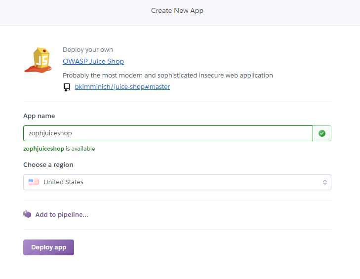
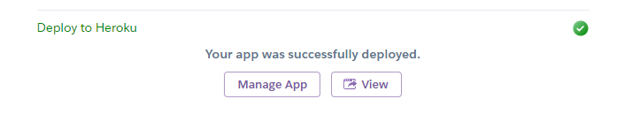
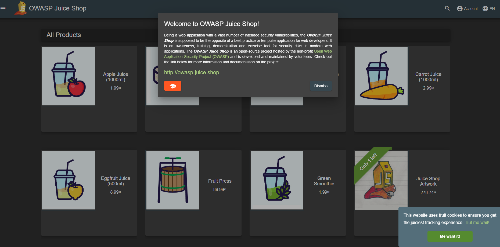

## Setting up Juice Shop

### Background

OWASP Juice Shop is probably the most modern and sophisticated insecure web application! It can be used in security trainings, awareness demos, CTFs and as a guinea pig for security tools! Juice Shop encompasses vulnerabilities from the entire OWASP Top Ten along with many other security flaws found in real-world applications! 

Website: https://www.owasp.org/index.php/OWASP_Juice_Shop_Project 

### Instructions

We're gonna setup a cloud instance of Juice Shop that you can interact with. 

1. Navigate to https://signup.heroku.com/ and create a free account. 

2. Once you've created your account, navigate here: https://dashboard.heroku.com/new?button-url=https%3A%2F%2Fgithub.com%2Fbkimminich%2Fjuice-shop&template=https%3A%2F%2Fgithub.com%2Fbkimminich%2Fjuice-shop

3. Create a name for your app. This has to be unique. 
  

4.  Once you've created a username, click on **Deploy App** and let the installation process finish.

5. Once the install is done, click on the **View** button.  Note: is the view button is not there, the URL should be displayed in the Build app window followed by the words `deployed to Heroku.`
  

6. **SAVE THIS URL** This is where you'll interact with the Juice Shop vulnerable web application.
  

### Navigating Juice Shop

1. Log in and create an account on Juice Shop, and then get an idea of what the store feels like. 

2. Read over the following material: 
  * https://bkimminich.gitbooks.io/pwning-owasp-juice-shop/content/part1/categories.html
  * https://bkimminich.gitbooks.io/pwning-owasp-juice-shop/content/part1/challenges.html
  * https://bkimminich.gitbooks.io/pwning-owasp-juice-shop/content/part1/rules.html
  * https://bkimminich.gitbooks.io/pwning-owasp-juice-shop/content/part1/happy-path.html

4. Find the Scoreboard, and submit a screenshot of that to complete your homework. 
