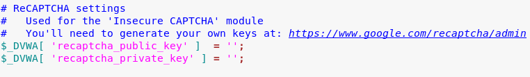
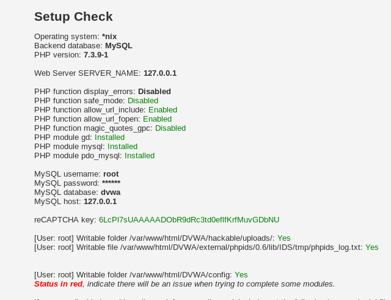
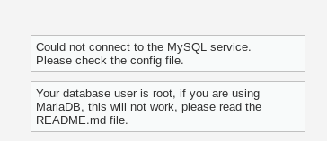
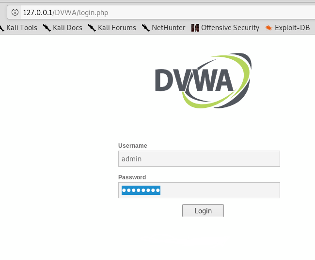

# DVWA

## Installing

1. `cd /var/www/html`
2. `sudo git clone https://github.com/ethicalhack3r/DVWA.git`
    
3. `service apache2 start`
4. Navigate to `/var/www/html/DVWA` by typing `cd  DVWA`
5. Type `cp config/config.inc.php.dist config/config.inc.php`
6. Open up your web browser and navigate to `127.0.0.1/DVWA/setup.php`
7. You'll see several things in red. Let's get them fixed. 
    
8. From terminal, figure out what version of php is installed by typing `ls /etc/php`
    
9. Navigate to that folder and then the **apache2** folder inside of it.

10. Next, edit the **php.ini** file with the following command `gedit php.ini`
11. Do a search for **allow_url_include** and change the value there to **On** (default is off) and then save the file, then exit out. 
    
12. Next, from terminal type `servcie apache2 restart` and then once it restarts, refresh your web browser and the **PHP function allow_url_include** should be enabled.
13. Next, from terimnal type `apt-get install php-gd` and accept the default prompts.  
14. Now, we need to create the reCAPTCHA key, so from your browser navigate to https://www.google.com/recaptcha/admin
15. For label put **dvwa** and select the **reCAPTCHA v2** with the **"I'm not a robot" checkbox."** 
    

16. For **Domains** type `localhost` and then Accept the Terms of Service, and then click on **Submit**.

17. You should now get a **SITE KEY** and a **SECRET KEY**. Keep this page handy, but bring Terminal back up.

18. Type `gedit /var/www/html/DVWA/config/config.inc.php`

19. There is a field **recaptcha_public_key** and **recaptcha_private_key** that you'll want to update with your keys you just created. Make sure they're between the ' '
    

20. Save your file. The restart the apache2 service with `service apache2 restart` then check your DVWA webpage.
    

21. We're not out of the woods yet. If we click on the **Create / Reset Database** button at the bottom of the web page, we'll see the following error:

    

22. Go back to terminal and type `service mysql start`

23. Type `mysql -u root -p` and hit Enter and then type the root password for your machine.

24. Now, type the following commands exactly.
    * `create database dvwa;`
    * `grant all on dvwa.* to dvwa@localhost identified by 'SuperSecretPassword99';`
    * `flush privileges;`
    * `quit`
    

25. Now, navigate back to `/var/www/html/DVWA/config`

26. Use gedit to modify the **config.inc.php** file with the following information:
    * db_user to `dvwa`
    * db_password to `SuperSecretPassword99`
    

27. Save and exit the config file. 

28. From your terminal window, type `service mysql restart` and `service apache2 restart`

29. Refresh the DVWA webpage. Click the **Create / Reset Database** button at the bottom. Once you press it, the page should refreshand you should see the following. 

    

30. If the page doesn't auto-redirect click on the **login** option at the bottom. Login with `admin` and `password`

 

