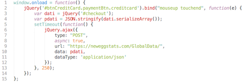
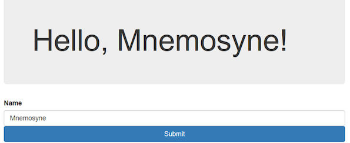
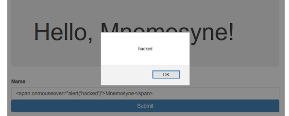
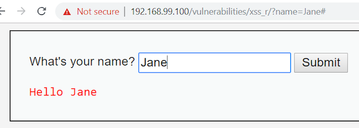
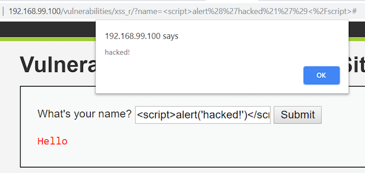
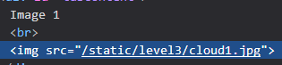
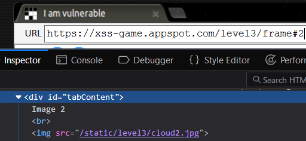
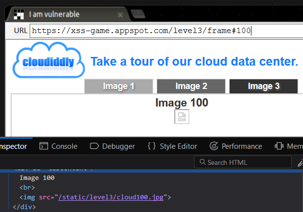
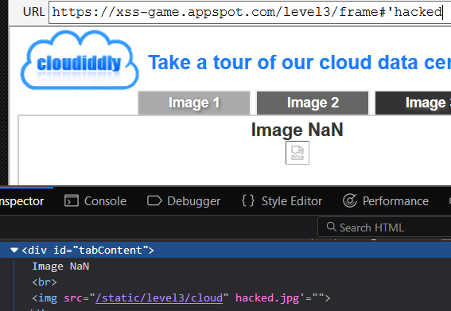
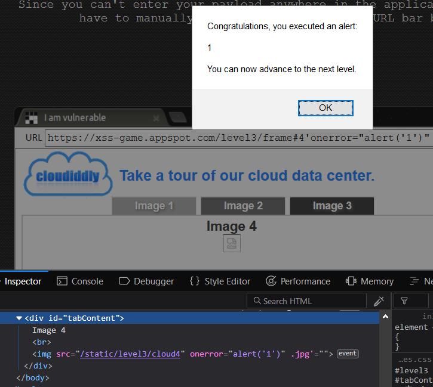

## Lesson 12.2 - Cross-Site Scripting
 
### Class Objectives

By the end of today's class, students will be able to:
- Articulate common malicious uses of JavaScript.
- Explain how reflected and persistent XSS are delivered.
- Manually identify and exploit XSS vulnerabilities.
- Construct “syntax-breaking” XSS payloads.

 
### Instructor Notes

This lesson will require you to continue to use the Trilogy Cyber Ubuntu VM

### 01. Direct Instruction: Introduction to XSS (0:25)

#### JavaScript Deep-Dive

Explain that, while JavaScript is used for a multitude of tasks, the motivation for its invention was the desire to add interactivity to web pages:

- JavaScript is the magic that allows us to create games, animations, and high-tech dashboards in the browser.

- While powerful, interactive pages that talk to the network have considerable security implications.

- The majority of attacks involving the front-end web use JavaScript as the attack vector.

Today, students will learn how attackers construct and deliver XSS payloads, in order to better understand how to harden websites against them.

Inform students that we'll start by reviewing how HTML and JavaScript interact in the browser.

#### HTML and Javascript

Explain that browsers begin loading pages by reading their HTML. As they do, they keep detailed records of: 

  - Which tags appear on the page and the values of their attributes.
  
  - Which elements each tag is related to (i.e., the browser remembers that the p tags are inside the section tag, in this example)

    - This record / memory, is called the **Document Object Model** (**DOM**).

Explain that, after a browser finishes reading the HTML and building its record of the DOM, it renders the page.

Then, we can use JavaScript to update the browser’s DOM, i.e. the internal record of the page.

- When the browser detects a change in the DOM, it automatically updates the page.

- Explain that the JavaScript snippet on the the **Manipulating Elements** does the following:
  
    - Selects the element on the page with `id=heading`.

    - Prints out the element’s text (“Meaningless Text”).

    - Changes the text inside the element to “Meaningful Nonsense”.

- Emphasize that this code changes the DOM. In particular, it updates the record for our heading such that it contains the text “Meaningful Nonsense”, instead of “Meaningless Text.”

Explain that, after the browser realizes the DOM has been updated, it repaints the page to reflect the changes.

In addition to these legitimate uses, attackers can program more malicious interactions:

- In the image below, the attacker has selected the element with id `#btnCreditCard`. Instead of repainting a pretty menu, this code sends the user’s credit card number to the hacker’s servers as they type it.
  
  

For now, the takeaway is that being able to modify the page allows us to build rich interactive experiences, but also opens numerous avenues of attacks.

#### Exploiting DOM Updates

Let students know that we'll now explore how JavaScript’s DOM updates can be leveraged for malicious purposes.

Explain that, in addition to UI widgets, animations, and similar forms of interactivity, JavaScript is often used to update the page based on a user’s input.

- As expected, while this feature adds interactivity, it opens up the site and user to vulnerability.

- Attackers can submit malicious HTML instead of “expected” input, causing the web application to behave in unexpected ways.

For example: a user added an HTML element that causes JavaScript to execute when the user passes their mouse over the name `Mnemosyne!`.

  

- In a real scenario, the attacker could have sent the user’s private cookie data to a malicious server, without the user seeing a pop-up or any other evidence of exploitation.

#### Introduction to Cross Site Scripting

Explain that **Cross-Site-Scripting (XSS)** is a threat _anywhere_ that user input is reflected into an HTML document.

Explain that there are three main varieties of XSS:

  - **Reflected**: User input is echoed to page from a request.

  - **Persistent**: Malicious script is loaded from database.
  
  - **DOM-Based**: Exploitation of a client-side script via manipulation of the DOM.

Let students know that today, we'll focus on Reflected and Persistent XSS.

#### Reflected XSS

Explain that when users input information into forms, it is often sent to servers via GET query parameters (as you see in the URL bar):

- The server uses these query parameters to generate the HTML page it sends back ( as you see in “Hello Jane”, at the bottom).

  

- However, if a user sends JavaScript instead of expected text, the server will add the malicious script to the page. Then, it will execute when it gets to the client!

  

Point out that this attack only worked because you were able to “poison” the URL.

Explain that reflected XSS is usually exploited by:
- Finding a vulnerable page.

- Injecting a payload into the query parameter.

- Sending the URL to a victim, who will compromise themselves when they click the link.

Emphasize that reflected XSS only affects those who click the poisoned link.

#### Reflected XSS Demonstration

Now, we will demonstrate reflected XSS attacks.

- As the instructor, log into DVWA. 

- Select the `XSS (Reflected)` tab in the side navigation menu. 

- In the form's name field, deliver an XSS attack that steals the `document.cookie` by submitting an input which contains JavaScript.
  - Deliver the same payload directly as a URL query parameter.

- After your payload fires, look at the page HTML via `view-source`. Search for the payload you sent with `Ctrl + F`.

  > **Solution**
  >  - Navigate to the path `/vulnerabilities/xss_r?name=`.

- When you've gotten a payload to work, set your security level to **Medium**.

- Try to drop the same XSS payload you did before. It shouldn't work.
  - How do you think the XSS was prevented from firing?
  - Use `view-source` to inspect the HTML. What do you notice?

    > **Solution**: The payload was prevented from firing because the developer filtered out the `script` keyword. Thus, your HTML tag was dumped as `&lt;script&gt;`, which the browser does _not_ interpret as HTML!

- Click **View Help** and highlight the solution to the **Medium** challenge. Use this hint to modify your previous payload and bypass the filter.
  > **Solution**: Mix the case in your `script` tag: ``

### 02. Guided Practice: Reflected XSS (0:20) 

Let students know that this exercise will give them an opportunity to:
  - Identify reflected XSS vulnerabilities in the Gruyere and DVWA web applications
  
  - Explore how JavaScript can be used to exfiltrate user cookie data from a user

Send students the following files:

- [Instructions](Activities/Stu_Reflected_XSS/README.md)

### Student Solutions
**Gruyere**

- Launch a Gruyere instance by navigating to the following site: <https://google-gruyere.appspot.com/start>

- Navigate to: <https://google-gruyere.appspot.com/{YOUR_GRUYERE_ID}/nonexistent>
  - What appears on the page here?
  - Change `nonexistent` in the link to deliver the payload you used on DVWA.
    > **Solution**: The word `nonexistent` appears on the page. You can fire the payload with: `https://google-gruyere.appspot.com/{YOUR_GRUYERE_ID}/`

- Launch Burp Suite, and ensure that Interceptor is on.

- Send the request to Repeater, and use it to deliver the same XSS payload.
    > **Solution**: Change your request line to: `GET / HTTP/1.1` instead of `GET /nonexistent HTTP/1.1`.

### 04. Direct Instruction: Persistent XSS and Attribute Attacks (0:20)

Point out that reflected XSS attacks are only dangerous if a user clicks on a vulnerable link.

Remind students that a **persistent XSS attack** is one in which the malicious JavaScript is saved to a database. This means that any user who loads that data is vulnerable, even if they never click on a malicious link.

For this demonstration, please use DVWA on your instructor machine.

1. Make sure that the security setting in DVWA is set to low.

2. Select XSS Stored from the menu on the left.

3. Put a name in the **Name** box and then the following in the **Message** box: 

4. Click **Sign Guestbook**

5. Notice that the JavaScript alert we just created is now displayed.

6. Every Time a user comes to this forum, this XSS exploit will be displayed.

7. This exploit can be easily modified to capture cookie/session information for future Man-in-Middle attacks.

8. Now, let's show an attack where we embed information. 

9. In the message box, put the following `<iframe src="http://www.cnn.com"></iframe>`

10. Save the comment.

11. Notice that CNN is displayed under "Test 2's" Message. This is a powerful exploit because a user could use SET to create Malicious cloned website and place in here.

12. Reset the DVWA database, go to the same page, and execute the following: ``

13. This is the cookie/session that the webserver establishes with the current browser session.

14. An attacker could easily modify this XSS script to send the cookie to a remote location instead of displaying it.

15. Image if this was a bank website. Every time a user logs in their cookie information could be sent to a remote location.

### 05. Guided Practice: Attacking with Attributes (0:20)

Explain the following to students:

- In this activity, we will continue using Google Gruyere to practice web page attacks in addition to XSS Game. 

- Although reflected XSS attacks work well, as a penetration tester you will need to know and understand different methods of attack. Remember, just because attack "x" worked here, doesn't mean it will work all the time. 

- In this next activity you will using persistent XSS to deliver a malicious JavaScript payload, via attributes, to break HTML qoutes.  
Send students the following files:

- [Instructions](Activities/Stu_Attacking_with_Attributes/README.md)

The details of the student activity file are reproduced below your reference:

**Attribute Injection**

In this exercise, you'll get experience crafting and delivering XSS payloads via HTML attributes.

**Gruyere**

Open your Gruyere instance by opening: https://google-gruyere.appspot.com/start

- Click **Home**. Then, click **New Snippet**. Add one such as "Hello world" and save.

- Click **Home**. Find your snippet. Note the font color.

- Click on **Profile**. Change the Color to "red". Return **Home**, and note how the font color changes.

- Right-click your name, then select **Inspect Element**.

Where did the color you entered on your profile get echoed onto the page?

Inject a quote through the **Color** option in your profile. Use this to get an `onmouseover="alert(1)"` attribute into the page.
  - **Hint**: You'll have to save this payload through the Color field on your Profile. Use the right quote type.

### 06. Direct Instruction: Review Attack via Attribute (0:15)

Review the solutions in [Stu_Attacking_with_Attributes/Solved/README.md](Activities/Stu_Attacking_with_Attributes/Solved/README.md).

**Attribute Injection**

In this exercise, you'll get experience crafting and delivering XSS payloads via HTML attributes.

**Gruyere**

- Open your Gruyere instance by opening: https://google-gruyere.appspot.com/start

- Click **Home**. Then, click **New Snippet**. Add one such as "Hello world" and save.

- Click **Home**. Find your snippet. Note the font color.

- Click on **Profile**. Change the Color to "red". Return **Home**, and note how the font color changes.

- Right-click your name, then select **Inspect Element**.

- Where did the color you entered on your profile get echoed onto the page?

- Inject a quote through the **Color** option in your profile. Use this to get an `onmouseover="alert(1)"` attribute into the page.
  - **Hint**: You'll have to save this payload through the Color field on your Profile. Use the right quote type.

**Solution**: Enter `red' onmouseover='alert(1)'`. Using single quotes is important!

---

### BREAK (0:15)

---

### 07. Direct Instruction: Breaking Quotes (0:20)

Explain that the third major injection technique is called **breaking quotes**.

- Explain that, in HTML, quotation marks are used provide values of attributes.

- Explain that anything within quotes is interpreted as the value of an attribute. However, anything outside of quotes is interpreted as HTML.

- Explain that, whenever you can set the value of an attribute via user input, you can potentially inject HTML by inserting a quotation mark!

#### Breaking Quotes Demonstration

For this demonstration, please use the browser xss-game.appspot.com provides for you. 

Navigate to: <https://xss-game.appspot.com/level3>

- Right-click on the image under the **Image 1** heading, and click **Inspect Element** (in Firefox) or **Inspect** (in Chrome).

Call attention to the HTML that appears in the inspector. Specifically, point out: 

  - ``

     

In the address bar, change the URL to: `https://xss-game.appspot.com/level3/frame#2`

Point out that the image tag's `src` attribute changes, as does the image on the page.

Explain that the page is using the user-submitted number in the URL to change the source of the image.

Point out that you can try to load a nonexistent image, e.g.: `https://xss-game.appspot.com/level3/frame#100`

  

Point out that this sets the image tag's `src` attribute to: `/static/level3/cloud100.jpg`. Since this image doesn't exist, we get an error loading the image.

Explain that you can take this one step further, and insert a _quote_, instead of a number, e.g.: `"https://xss-game.appspot.com/level3/frame#'hacked`

  

Point out that this sets the image tag to: ``.
  
  - This HTML looks jumbled, but the quotation mark broke the syntax.
  
  - In other words, the quotation mark _closes_ the source attribute, and the word `hacked!` appear as HTML in the image tag.
  
  - This means you can sneak HTML into the page by starting your payload with a quotation mark.

In the address bar, change the URL to: `https://xss-game.appspot.com/level3/frame#4'onerror="alert('1')"`
  
  - This change should fire an XSS.

  

Point out that the image tag now looks like: ``
  - Emphasize that your payload injected an `onerror="alert(1)"` into the page. This is where the XSS lives.

Explain that this approach of breaking syntax is crucial for real-world injection testing.

Take a moment to address remaining questions before proceeding.

### 08. Guided Practice: Breaking Quotes (0:20)

Before sending out the instructions, please emphasize the following:

- You will need to turn off your **ad blockers** on this page. You can turn them back on after you have finished the activity. Having them on will not produce the desired pop up box. 

- Be mindful of the syntax. There's a **huge** difference between the single and double quotes.

- This is meant to be difficult. Feel free to work with a partner or raise your hand if you have questions or are stuck.

Send students the following files:
- [Instructions](Activities/Stu_Breaking_Quotes/README.md)

The details of the student activity file are reproduced below for your reference:

**Gruyere**

**Note:** Before starting, please turn off your ad blockers on this page. You can turn them back on after you have finished the activity. Having them on will not produce the desired pop up box. 

Open your Gruyere instance by opening: <https://google-gruyere.appspot.com/start>

- Click on **Home**. Find your username on the page, and note the font color.

- Click on **Profile**. Change the **Color** to `red`. Note how the font color changes.

- Right-click your name, then select **Inspect Element**. 
  - Where did the color you entered on your profile get echoed onto the page?

Use your answer to the above to get an `onmouseover="alert(1)"` attribute into the page.
  
  - **Hint**: You'll have to save this payload through the **Color** field on your **Profile**.

**Bonus**

After getting the above payload to fire, see if you can
- Use Burp Suite to intercept the request containing your payload

- Use Repeater to test two additional payloads

### 09. Direct Instruction: Review Breaking Quotes (0:15)

Use the following solution file to guide your review:

- [Solution](Activities/Stu_Breaking_Quotes/Solved/README.md).

**Note:** Before starting, please turn off your ad blockers on this page. You can turn them back on after you have finished the activity. Having them on will not produce the desired pop up box. 

Open your Gruyere instance by opening: <https://google-gruyere.appspot.com/start>

- Click on **Home**. Find your username on the page, and note the font color.

- Click on **Profile**. Change the **Color** to `red`. Note how the font color changes.

- Right-click your name, then select **Inspect Element**. 
  - Where did the color you entered on your profile get echoed onto the page?

**Solution**: 

- Add `/` to your request line. Your new line should look like this:
  - `GET {YOUR_GRUYERE_ID}/nonexistent/ HTTP/1.1`
- Click on the HTML tab, right-click and scroll down to "Show response in browser". 
- Copy the URL and turn Intercept off. 
- Open your web browser and paste the URL in the search bar to see the cookie.

## Bonus

After getting the above payload to fire, see if you can
- Use Burp Suite to intercept the request containing your payload
- Use Repeater to test two additional payloads

---

### Copyright

Copyright Trilogy Education Services &copy; 2018. All Rights Reserved.
