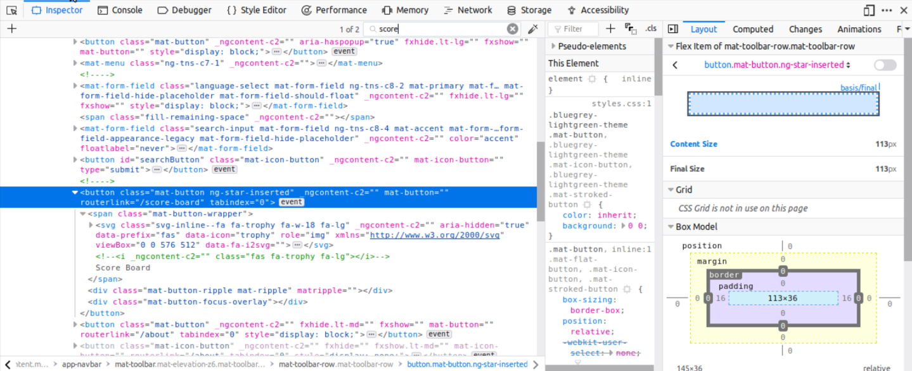
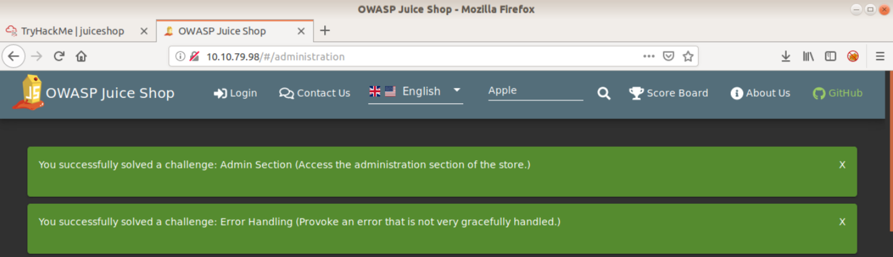
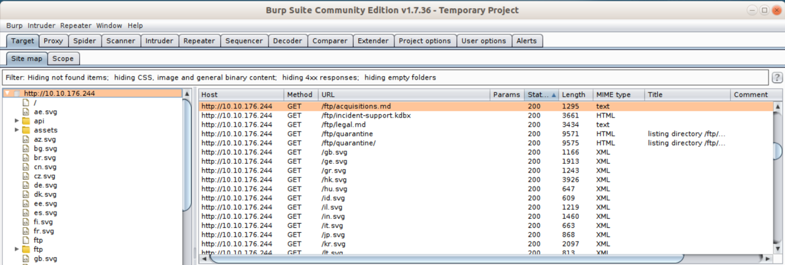
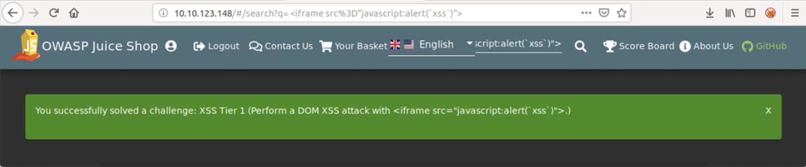

## Solved

Remember, there are  different ways to accomplish each of these tasks. 

- - -
Create a user account on the Juice Shop website before starting the test. 

Locate the Score board

 

**Hint:** What happens if you try directory traversal in the URL?
- **Solution:** type <ipaddress>/#/score-board

 

Locate the Admin Section

 

**Hint:** What happens if you try directory traversal in the URL?
- **Solution:** type `<ipaddress>/#/administration`. 

 

Confidential Document

 

**Hint:** Do you find anything interesting when you spider the website?
- **Solution:** BurpSuite shows there are several FTP documents you access.  Navigate to `<ipaddress>/ftp/acquisitions.md`.

 

Error Handling

 

**Hint:** Any request that cannot be processed by the server will be flagged as a global error. 
- **Solution:** Navigating to `<ipaddress>/#/administration` without admin privileges raises the error. 

 

XSS Tier 0

 

**Hint:** Review this link here https://www.owasp.org/index.php/Cross-site_Scripting_(XSS)
- **Solution** Search for an item. Click on the item, in the search bar uptop you will see `search=apple`. Replace your item with the code `<iframe src="javascript:alert('xss')">`. 

 

XSS Tier 1

 

**Hint:** Review this link here https://www.owasp.org/index.php/DOM_Based_XSS
- **Solution:** In the search bar type `<iframe src="javascript:alert('xss')">`. 

 

Zero Stars

 

**Hint:** Can you use BurpSuite to _forward_ the request?
- **Solution:** Capture the request using BurpSuite, change your rating to 0, then click **Forward**. 

 

