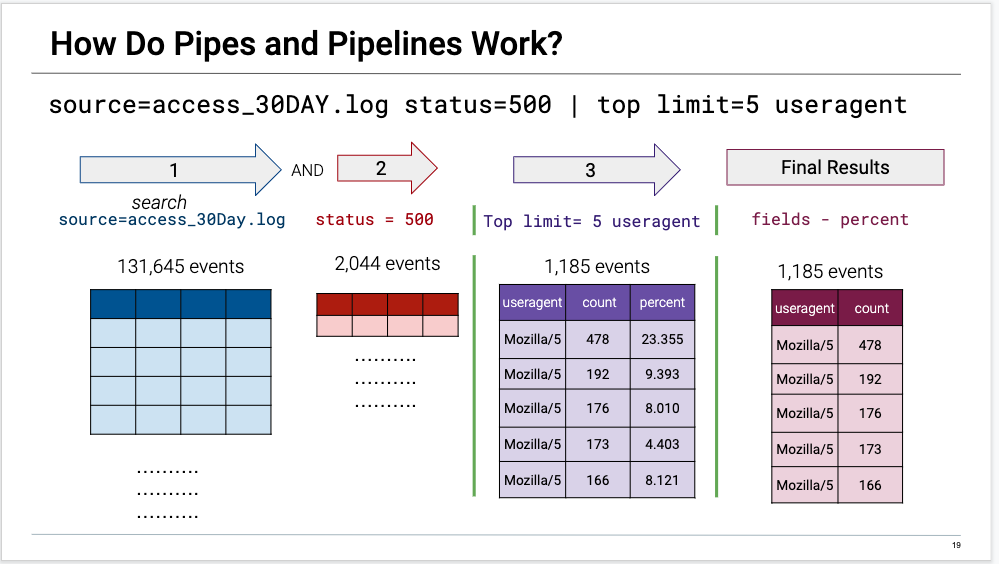
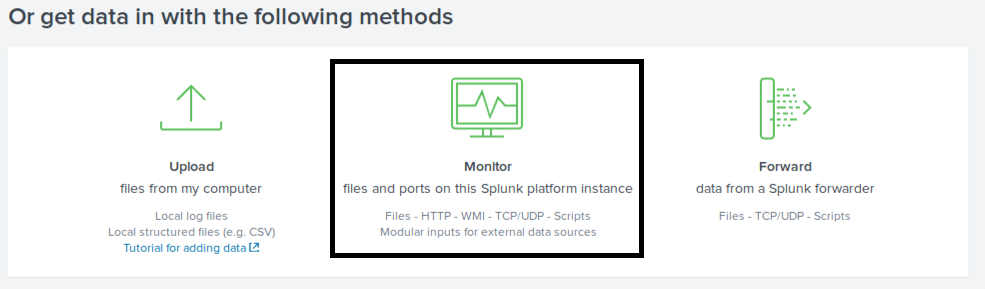
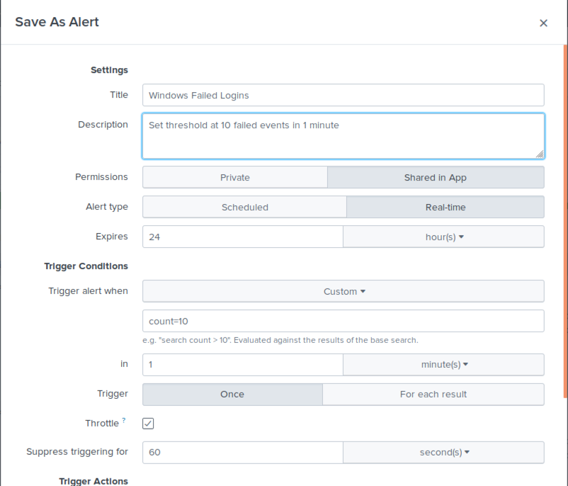

## SIEMS Day 2: Splunk: Searching, Statistics and Alerts Student Guide

## Lesson Overview

Today's lesson is the second part of the Security Information and Event Management (SIEM) unit.  You will continue to learn the Search Processing Language (SPL) and collect logs from different sources and how security teams use log data to detect and respond to security incidents. This lesson will also introduce you to `searching`, `statistics`, `baselining` and `alerts` using the Splunk Enterprise application.

## Lesson Objectives

By the end of lesson, you will be able to:

* Use SPL to create advanced searches.

* Describe how `pipes` are used to chain together a series of SPL commands.

* Use statistical methods such as `frequencies`, `baselines` and `thresholds`.

* Analyze events to develop `baselines` and `thresholds`.

### Student Notes

* The class continues with several demonstrations using the [Splunk Enterprise SIEMS](https://www.splunk.com/en_us/software/splunk-enterprise/features.html).

* If at any point throughout the lesson plan, you have an opportunity to speak about professional experience of your own, please feel free to share.


#### Lesson Lab Environment

Today's lesson will require the following:

* Ubuntu Virtual Machine 18.04

* Splunk Enterprise 7.2.4.2

* Output files from Snort 3.0

* Other Sources - Internal Splunk File:

    * `/opt/splunk/var/log/splunkd.log`

#### Lesson References

- [Main Documentation Page](https://docs.splunk.com/Documentation/Splunk)
- [Search Tutorial](https://docs.splunk.com/Documentation/Splunk/7.2.4/SearchTutorial/WelcometotheSearchTutorial)
- [Search Manual](https://docs.splunk.com/Documentation/Splunk/7.2.4/Search/GetstartedwithSearch)
- [Splunk Search Reference](<https://docs.splunk.com/Documentation/Splunk/7.2.4/SearchReference/WhatsInThisManual>)
- [Alerts](<https://docs.splunk.com/Documentation/Splunk/7.2.4/Alert/Aboutalerts>)
- [Snort](https://www.snort.org)


#### Lesson Slideshow

- The slides for today's lesson can be viewed on Google Drive here: [SIEMS Day 2 Slides](https://docs.google.com/presentation/d/10qUyRXj5qy01-aoRcvtPH52IF1iD-NeITEEEvkZUzY8/edit)

- To add slides to the student-facing repository, download the slides as a PDF by navigating to File > "Download as" and choose "PDF document." Add the slide PDF file to your class repository along with other necessary files.

- **Note:** Editing access is not available for this document. If you wish to modify the slides, please create a copy by navigating to File > "Make a copy...".

- **The slides for today can be viewed on Google Drive here**: [SIEMS Day 2 Slides](https://docs.google.com/presentation/d/10qUyRXj5qy01-aoRcvtPH52IF1iD-NeITEEEvkZUzY8/edit?usp=sharing)

---

### Using the SPL Search Pipeline 

Remember from the previous day  that **SPL** is a language based on the **Unix Pipeline** and the **Standard Query Language** (SQL).

In this section, we will demonstrate **pipeline commands** in the SPL.

 * The demonstration uses the `access_30DAY.log` file located in the [Resources/tmp](Resources/tmp/access_30DAY.log) directory.  This file was used in the Day 1 exercises.

#### Unix Review: Pipes and Pipelines

You have already used the pipe operator `|` to send the standard output of one command to the standard input of another command. But as a quick review let's go over it, what do the following commands do:

  - `$ ps -aux | wc -l`

    * This command displays the number of processes running in the system.

  - `$ ls var/log/*.log | grep conf | wc -l`

    * This command gets the list of files in the `var/log` directory with the `*.log` extension.

  * The output from the `ls` command is passed to the `grep` command to look for the string `conf`.

  * The output from the `grep` command is passed to the `wc` command to count the number of lines.

#### SPL: How Do Pipes and Pipelines Work?

Both **pipes** and **pipelines** are used in the Search Processing Language (SPL).

* Pipes are used in the SPL to *narrow down search results to specific criteria*.

* Point out:

    * Like Unix commands, a vertical bar `|`  is used to chain together a series (or pipeline) of search commands.

    * Commands are processed from left to right. The result of the command to the left of the `|` operator is fed into the command to the right of the `|` operator.

    * The intermediate command results table from each search is (piped) used as input to the next command.


* By looking below you'll see a search that displays the top five useragents with the number of internal server errors. The result was narrowed from over 130K events.

  * Let's go through each command and the command options used in the following pipeline.

    - `source=access_30Day.log status=500 | top limit=5 useragent | field - percent`

        


### Walkthrough: Traveling Down the Pipeline.

* To understand what each command does, let's take a closer look by typing the commands *in succession* in the search window. 

**Step 1.** First we will display **ALL** the events indexed from access server log.

  * Enter: `source=access_30Day.log`

     

  * Notice that there are over 131,000 `HTTP GET and POST` events in the access log.


**Step 2.** Next, we are only interested in the events where the server returned a `500 error`.

* To do that we will need to append the `status` field to the command.

  * source=access_30Day.log `status=500`

* Notice that:

  * This command contains an implicit `AND` Boolean operator.

  * The search uses the **status** field which holds the `status codes` returned by the web server.

  * This narrows the search result to 2,044.

     


#### The First Pipe.

**Step 3**. Let's go ahead and add the first pipe. 

* The event results from Steps 2 will now be **piped** into the next query.

* Let's append the `top limit=5 useragent` to the command.

    - `source=access_30Day.log status=500 | top limit=5 useragent`

* Let's talk about the field and commands in this SPL statement:

  * `user-agent` is a field in a `http request header` and contains a  string that allows the network protocol peers to identify the application type, operating system, software vendor or software version of the requesting software user agent.

#### The `top` command:

 * See Reference here:(https://docs.splunk.com/Documentation/Splunk/7.2.4/SearchReference/Top)

  * The `top` command with the `limit` command option returns the top five useragents.

  * By default the `top` command display the top 10 results.  The `limit` option is used to specify the returned results. The command will display the top 5.

  * The `top` command also returns the `count` and the `percentage of frequency`.

* It is IMPORTANT to note that the result from this search command is displayed in the **Statistics** tab.

    

#### The Second Pipe.

**Step 4.** The second pipe command removes the percent field using the `fields` command.

* Let's append the `fields - percent` to the command.

  - `source=access_30Day.log status=500 | top limit=5 useragent | fields - percent`

     


* The result from this search command is displayed in the **Statistics** tab.


### Walkthrough: Using Tables to Display Events in Splunk

In this section we continue with the Splunk `pipeline` and see how to use the **table** command.  This command returns a table with only the fields that are specified. Documentation at: https://docs.splunk.com/Documentation/Splunk/7.2.4/SearchReference/Table

* We will now learn how to create **tables** and **label** the columns for their search results.

* By default the columns in a table are labeled using the *field name* but this may not always be helpful.

* Given an example: What does the *count* field mean in different searches (e.g., count of errors? count of purchases?).

* Notice that using a *labeled table* makes it easier to interpret the results of searches in reports and dashboards.

#### Start of walkthrough: How to Create Tables

**NOTE:** This demonstration uses the file [alert_json_000015.log](Resources/tmp/). 

Let's create a search using the table command and label the columns: `Protocol`, `Source IP and Port` and `Destination IP and Port`. Run the search for *src and dest IP* in the range `"192.x.x.x"`.

The search command is:

```bash
  source="alert_json_000015.log" proto="UDP" src_ap="192*"  dst_ap="192*" | table proto,
   src_ap, dst_ap, | rename proto AS "Protocol" src_ap AS "Source IP and Port" dst_ap AS
    "Destination IP and Port"
```


* The table columns are `Prototype` and the Source and Destination `IP and Port`.

#### The `table` Command:

  * The `table` command is proceed by a pipe `|` character.

  * The `rename` command is used to create the labels for the columns. It is proceeded by a `pipe` character. Columns are displayed in the same order that fields are specified.

  * The first `AS` statement sets the `proto` field to display the text **Prototype** in the column header.

  * The next `AS` statements set the `src_ap` and `dst_ap` fields to display the text  **Source IP and Port** and **Destination IP and Port**.


### Alerts in Splunk

In this section, let's talk about how *events* from searches are used to trigger **Splunk alerts**.

#### Understanding the Splunk Alert

* Remember that that *monitoring* and *alerting* is a key component in Splunk.

* Alerts are used to monitor for and respond to specific events.

* Alerts look for events in *real time* or on a *schedule*.

* Alerts can also be assigned a *priority* such as Informational or Critical.

#### Parts of a Splunk Alert

This section briefly explains the parts of a Splunk alert so that you will be able to configure and test an alert.

* Splunk alerts have a structure that defines how alerts are configured and handled. The structure is:

    ```bash
        alert-type triggering-options throttling-options
    ```

* **Alert Type**. In Splunk there are two alert types: *scheduled* and *real-time*.

    * The alert type determines when events are searched.

    * `Timing options` or `cron` syntax can be used.

* **Triggering-Options**. The *triggering* option specifies *how* and *the number of times* an alert is triggered. How this option behaves depends on the alert type (e.g., scheduled or real-time).

* **Throttling-Options**. The *throttling* option specifies *the time period for suppression*. How this option behaves also depends on the alert type (e.g., scheduled or real-time).

#### Real-time and Scheduled Alerts

* Let's look at some examples of a *real-time alert*. These events monitor events continuously and can be configured to trigger **once per result** or within a **rolling time window**.

    * If we want to trigger an alert every time there is a password failure on the root account. The *triggering options* are set to alert every time there is a search result. This is called *per-result* triggering. A custom script is run to alert the security team.

    * We want an alert to trigger if a service has more than three errors in a minute. We  configure a real-time alert that searches for the service error event. We specify a one minute *rolling window*. An email is sent to the operations team.

* Give examples of a *scheduled alert*.  These alerts search for events based on a scheduled time.

    * We want to monitor how often a server returns a 500 error.  We create a scheduled alert that searches for 500 errors every half hour and triggers an event when there are more than 50 results. A notification is logged to the Triggered Alert list.

    * We configure an alert if a host stops forwarding logs after a **threshold limit**. For example, an attacker will take over a machine and stop all service. We raise an alert if a host has not forwarded the logs for more than one hour.

#### What to Consider When Configuring an Alert in Splunk

Next, let's discuss best practices when configuring Splunk Alerts.

* It is important to schedule a time range that prevents data from being evaluated twice in a search.

* Events should be scheduled with a minimum of a one minute delay.

#### Demo: Create a Real-time Alert for Monitoring a System File

Splunk can monitor logs and also internal files. Let's walkthrough how to create and monitor a real-time alert by monitoring a system file for **failed logins to the Splunk server**.

1. Let's create a search and alert that **monitors** errors in the internal Splunk log at `/opt/splunk/var/log/splunk/splunkd.log`. The alert will be logged to the Triggered Alert list.

2. To do this, instead of uploading a file, click on `Monitor`



3. Navigate and select the `/opt/splunk/var/log/splunk/splunkd.log` file. Save the host as `splunkd`.

4. Enter the following search in the Search window:

- `host=splunkd action=login status=failure`

- Set the Search Period to `All Time`.

- Click the search icon to run the search.

- **Note:** Because of the nature of this file, there will be a different number of events for everyone.

#### Saving as Alert

Now save the search as an alert.

1. Select `Alert` from the `Save As` drop down list.

    

2. Use the following values to populate the fields:

    * `Title` as **Error log from splunkd.log**

    * `Permissions` as **Shared in App**

    * `Alert type` as **Real-time**

    

    * `Trigger alert when` as **Per Result**

    * `Add Action` as **Add to Triggered Alerts -> Info**

    

4. Click **Save**.

5. Click **Triggered Alerts** to see the alerts.

    

 **NOTE:** We are triggering alerts in **real-time**.  Alerts will not be present in the Alert table at this time.

 #### Triggering the Failed Login Attempt Alert

 Next let's trigger an Info Alert.

 1. Log out of Splunk.

 2. Log back in and enter an **incorrect username and password** (twice).

 3. Log in again with the correct username and password.

#### Viewing Alerts

Next let's view the failed login attempts.

1. There are two ways to view alerts, from the **Alert** App tab and the **Triggered Alert** list.

**Alert App Menu**

* This displays:

    

    Clicking on the Alert name displays the following view where an alert can be modified.

    

**Triggered Alert List**

* This displays:

    

    This shows the Alert in a table with the Severity status.

    

    Click **View results** to see the failed attempt.

    

**Deleting Alerts**

If you ever need to reconfigure or delete an alert, you can find a listing of all your alerts by navigating to the `Alerts` page. 

Demonstrate the following:
- Click on `Searching & Reporting` button on your homepage.
- In the top menu bar click `Alerts`. 
- Point out that you can see a list of alerts that you have created.
- Click on the `Edit` button and notice that from here that we can edit, disable, clone or delete the alert. 


### Using Baselines to Create Effective Alerts

To introduce baselining let's first take a look at a few scenarios:

- You are tasked with monitoring a web application where customers can purchase your company's products. You are concerned that there is a threat of an attacker attempting to brute force login to your application.

- Ask yourself the following:

   - How can we use Splunk so that we can be aware if a brute force attack is occurring?

       **Solution:** Create an Alert

   - Why would an alert that goes off every time there are several failed attempts not ideal?

      **Solution:**  This isn't ideal because you may have customers who have forgotten their passwords and have tried to log-in several ties. In other words, this alert would be a **false positive**.

- The process of **baselining** differentiates between a real attack and normal daily activity. Baselining entails looking at the **historical data** of normal activity to understand what the normal daily volume is.

- Take note that:

    - After we have looked at your historical activity and understand what your normal volume of daily bad logins is, there are some additional steps to creating a good alert.

    - Check to see if we previously have had a brute force attack to understand what the volume is for a typical attack. In other words, we are looking for the **volume of abnormal activity**.

    - We would then want to **create a threshold**.  A threshold is the volume of activity at which an alert is triggered.

    - When creating a threshold, it is important that you don't set too low, since that can create false positives.

    - At the same time, it is important to not set the threshold too high since we may then miss an attack.

#### Walkthrough: Analyzing Failed Login Events

Let's walkthrough analyzing a sample **Windows event** log. We will determine a *baseline* and appropriate *threshold* to create an effective alert.

**Note:** This is just a snippet - 15 minutes- of some Windows event logs where a **brute force attack** had occurred. In a real world scenario, we would need to look at a much larger set of historical data to get a more accurate baseline.

1. First, **load** the event logs file:

    - Import into Splunk  [`wineventlogs_baseline.csv`](Resources/tmp/wineventlogs_baseline.csv). Select all defaults when uploading. The file is also located in the resources folder.

2. **Run** a search:

    - After importing and selecting **Search**, it should default to the following search:

	`source="wineventlogs_baseline.csv" host="cyber-security-ubuntu" sourcetype="csv`

3. **View** the search results:

    - Note that although this only shows 10 minutes of windows event logs, a brute force attack did occur during that period.

4. Let's change the search to look at **failed logins**

  -  We could add the search term of `failure` to our search, but that would also show us every time a process has failed, not just login failures. In order to identify login failures we will click on `EventCode` then the event that we need.
  
    - Click on **Event Code** 

  - There are many event codes seen here. Although it is unlikely that a job interviewer will ask you what each specific code means, you will be expected to know how to find it. 
    
    - Google "Windows threat protection failed credentails" and click on the first link you see. The first link should navigate you to [here](https://docs.microsoft.com/en-us/windows/security/threat-protection/auditing/event-4776)
    
  - Notice that event code 4776 represents failed logon attempts. Navigate back to Splunk and enter the following:

   `source="wineventlogs_baseline.csv" host="cyber-security-ubuntu" sourcetype="csv" EventCode="4776"`

5.  Next, identify the **spike in locked users**:

- Can you see where the brute force attempt occurred?
  - `Solution:` It shows that the brute force happened throughout the 15 minutes but there was a spike in the middle of 15 events.

6. Now, let's look at the **baseline of normal activity**:

   - The other minutes displayed normal activity. What do you think is a good average number that indicates normal activity? We can point out the average is around `6`, but the range can be as low as `1` and as high as `12`.

7.  What is the **threshold** for the alert?

    - Based on the volume of an attack, and a baseline of the normal activity, what would be a good alert threshold to set?

    - Remember we do not want to set it too low and get false positives, or too high and miss an attack.

    - A good recommendation in this scenario would be to set a threshold to trigger an alert at `10 locked events` a `minute`.  This would give a buffer if the normal activity increases, but it is still low enough to identify an attack.

    - Emphasize that there is no perfect answer as alerts may need tuning as normal activity and attacks can change over time.

8. Now, let's see how the threshold could be configured in Splunk.

    * This **alert** can be created in Splunk using the **threshold** data.

    

-------

### Copyright

© 2019 Trilogy Education Services
