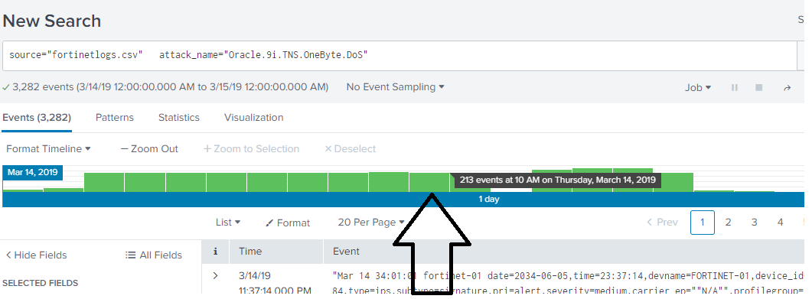
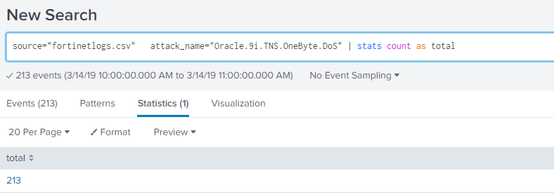
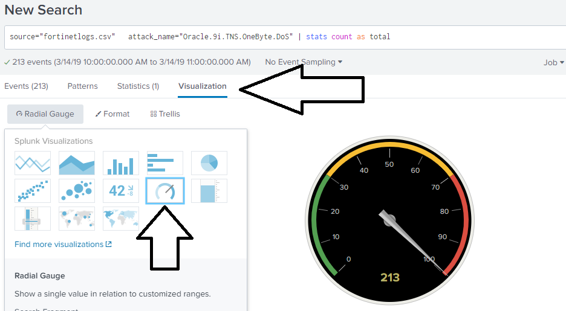
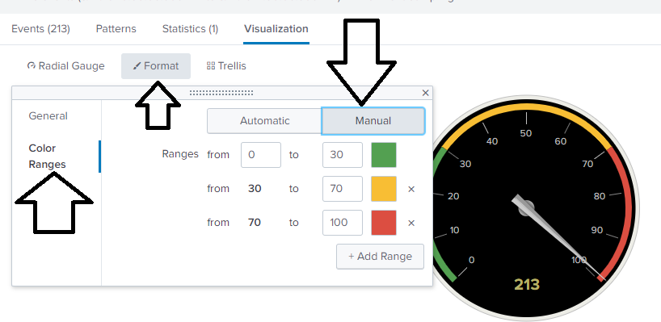
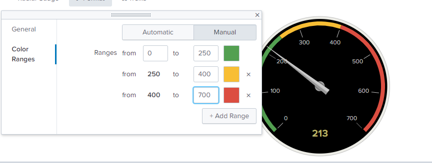
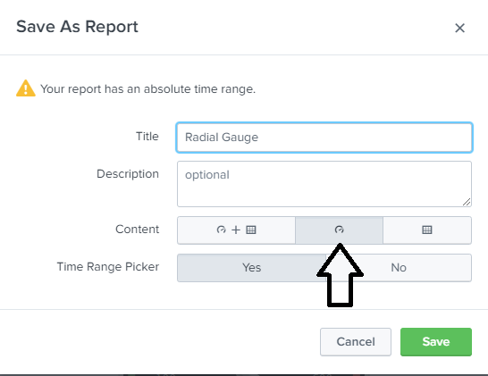
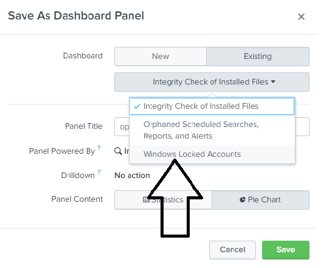
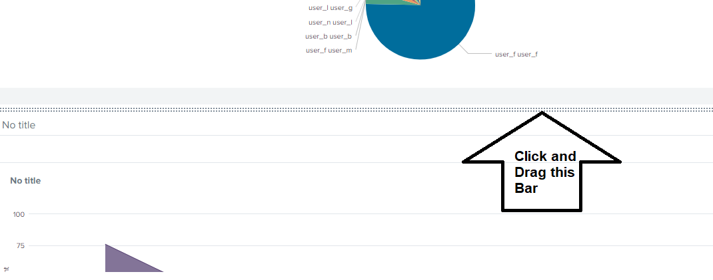
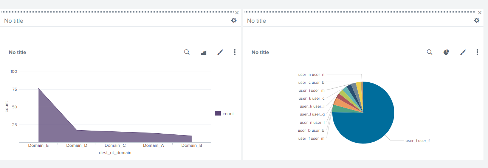

## SIEMS Day 3: Splunk Reports, Statistics, Dashboards and Visualizations Student Guide

### Lesson Overview

In the final day of the SIEMS unit we will cover reports, statistics, dashboards, and visualizations in Splunk. You will continue to use the search and SPL tools within the context of how security teams utilize reports, dashboards and visualizations in Splunk.    
 
### Lesson Objectives

By the end of the lesson, you will be able to:

- Use Splunk's documentation to implement new search commands.

- Generate and use `reports` from Intrusion Prevention System logs. 

- Perform `statistical analysis` based on event information.

- Use  `dashboards` to accelerate *time-to-insight* and *time-to-action*.

- Use `visualizations` to compare and aggregate event field data. 

### Student Notes

* Remember: 
   
   - When uploading data to Splunk, use unique `host` names whenever possible in order to avoid extraneous results from other searches. 

   - **For example**: if you upload `linux_30DAY.log` twice, and do not give each SPL a unique identifier when using that argument, Splunk will duplicate data from **all** the files that have been named `linux_30DAY.log`. 

* The class continues with several demonstrations using the [Splunk Enterprise SIEMS](https://www.splunk.com/en_us/software/splunk-enterprise/features.html). 

* If at any point throughout the lesson plan, you have an opportunity to speak about your professional experience, please feel free to share.

#### Lesson Lab Environment

The following will be required to complete today's activities and walkthroughs:

* Ubuntu Virtual Machine 18.04

* Splunk Enterprise 7.2.4.2

#### Demonstration and Practice Files  

You will also need the files from the previous classes.

* [wineventlogs_baseline.csv](Resources/wineventlogs_baseline.csv)

* [fortinet_logs.csv](Resources/fortinet_logs.csv)

* [fortinet_logs_new.csv](Resources/fortinet_logs_new.csv)

* [linux_s_30DAY.log](Resources/linux_s_30DAY.log)
    
#### Additional References

- [Reports](<https://docs.splunk.com/Documentation/Splunk/7.2.4/Report/Aboutreports>)
- [Dashboards](<https://docs.splunk.com/Documentation/Splunk/7.2.4/SearchTutorial/Createnewdashboard>)
- [Dashboard Quick Reference](<https://www.splunk.com/pdfs/solution-guides/splunk-dashboards-quick-reference-guide.pdf>)
- [Visualizations](<https://docs.splunk.com/Documentation/Splunk/7.2.4/Viz/Visualizationreference>)

**SPL Commands Used in This Lesson**
- [contingency](<https://docs.splunk.com/Documentation/Splunk/7.2.5/SearchReference/Contingency>)
- [top](<https://docs.splunk.com/Documentation/Splunk/7.2.5/SearchReference/Top>)
- [where](<https://docs.splunk.com/Documentation/Splunk/7.2.5/SearchReference/Where>)
- [status](<https://docs.splunk.com/Documentation/SplunkCloud/latest/SearchReference/Stats>)
- [timechart](<https://docs.splunk.com/Documentation/Splunk/7.2.5/SearchReference/Timechart>)
- [iplocation](<https://docs.splunk.com/Documentation/Splunk/7.2.5/SearchReference/Iplocation>)
- [geostats](<https://docs.splunk.com/Documentation/SplunkCloud/latest/SearchReference/Geostats>)

#### Lesson Slideshow

- Slides for today's lesson are available on Google Drive located here: [SIEMS Day 3: Splunk and Data](https://docs.google.com/presentation/d/1poYnaY40_Us1MPP9TdtFcnSRRECtrO57KMsqatHkseA/edit#slide=id.g5468a19447_0_2393)

- To add slides to the student-facing repository, download the slides as a PDF by navigating to File > "Download as" and choose "PDF document." Add the slide PDF file to your class repository along with other necessary files.

- **Note:** Editing access is not available for this document. If you wish to modify the slides, please create a copy by navigating to File > "Make a copy...".
---

### Generating Reports in Splunk

Now that you have worked with different search commands, it's time to introduce you to creating **reports** in Splunk. 

* Things to remember:

   * Reports are created when you **save a search**.  Each report contains the *event*, *field*  and *statistical* data that was generated from running the SPL search command.

   * Reports can be run anytime and they **fetch fresh search results** each time they are run. 

   * Reports can be **scheduled** to run at any interval.

   * Reports show **statistics** and **visualizations** and can be used in **dashboards**. 

   * Reports can be run as **historical searches** during a security incident investigation.

#### Walkthrough: Generate a Report for Failed Login Attempts

* Now that you have worked with searches in Splunk, the next step is to learn how to *create a report from the search results*.

* We will create a report that will run the search for **failed login attempts**. 

* Execute the following search using `your host name` and `All Time`.

   - `source="wineventlogs_baseline.csv" host=<your host name> sourcetype="csv" locked | contingency Account_Name Account_Domain`

* Select **Report** from the **Save As** drop down list. 

    

The **Save as Report** dialog box appears.

* Enter **Failed Login Search Report** in the `Title` field.

* Select **Yes** for the `Time Picker Range`. 

   * By selecting `Yes` we will be able to run the search with different time ranges. This is important to be able to run **historical** or **real-time** searches.

* Finish by clicking the **Save** button.

    

#### Viewing the Report

* We will select to **View** the report. 

     

* The **Title** and **Time Range** appear in the Report Heading

    * There are options to `Edit`, obtain `More Info`, and `Add to a Dashboard`.

    

#### How to find and run a search report.

* The **Report** tab located in the **App bar** is used to display reports.

    

* Click the `Report Title` (**Failed Login Search Report**) to run the search.

#### How to run a historical search report. 

* Security teams run historical search reports for use in *incident response* or *forensic investigations*.

* Select **Previous Month** from the Time Picker.

    

### Visualizing Single Event Data Points in Splunk

* In this section, we'll learn how to create a variety of visualization elements of the data. Visual elements include charts, buttons, or maps.  

* We have been displaying data in the Events and Statistics tab, but Splunk provides more useful visual representations. 

* Visualizations make it easier for Security teams to analyze and interact with data during day-to-day operations and during investigations.

* Visualization elements that are available under the **Visualization** tab such as bar, pie and bubble charts, radial and filler gauges and geographic maps. 

    
    
* Visualization elements are selected based on if the data being represented is a single data point, or if multiple data points are being displayed.
  - An example of a **single data point visualization**, would be a total count of Attacks displayed as a single number
  - An example of a **multiple data point visualization**, would be a spreadsheet of counts of attacks, correlated to attack types
	
#### Walkthrough: Visualizing Data from Firewall Attack Logs with single data point visualizations

* There are times when a single data point needs to be visualized, and be visualized with severity levels
  - For example, if a web application wanted to look at a single data point such as "count of bad logins" over the last hour.
  - A visualization could illustrate if that data point is currently at a normal, high or critical level.

* This visualization can be accomplished by using a **Radial Gauge** Visualization.

* **Radial Gauges** are similar to what you see in your Car's Dashboard when looking at your car's RPM. 
  - RPM - (Revolutions per minute), is the single data point your car's Dashboard is visualizing
  - In your RPM display, if your RPMs reach a certain value, it is typically represented in Red indicating you have reached a level that is too high.
 
#### Getting Started

In this walkthrough, we will use event data from the Fortinet Firewall Attack Log Student Activity.  

* Start by uploading the fortinet_logs.csv into Splunk.

For this example, we will want to measure the attack type of `attack_name="Oracle.9i.TNS.OneByte.DoS"` over an hour period with a radial gauge.

First create the search for this value, enter in the following search after the file has been uploaded:

- `source="fortinetlogs.csv"  attack_name="Oracle.9i.TNS.OneByte.DoS"`

- We want to analyze this value over a 1 hour period, so double click on the 10 AM hour to drill down into this data.

- We are selecting a 1 hour period as an example of what we want to monitor for this attack type, a real SOC would make their own determination of the time period they want to monitor dependent on their own environment and past attacks they have seen.

- We want to now take this total count over the last hour, and create a SINGLE VALUE of this data.

- To do this, add `| stats count as total` at the end of the search, and then select the `SEARCH` option again

- Now this is a single value, we can create a Radial Gauge

- To do this, select `Visualization` and then select the `Radial Gauge` option

- In this radial Gauge the different color values were created by default by Splunk:
  - Green : 0 - 30
  - Yellow : 30 - 70
  - Red : 70 - 100

- These values of ranges and colors can be customized based on your preferences.
 
- A SOC may want to potentially correlate the red value to a separate alert they have previously setup, where if the value reached the red range, then an alert would be triggered

- To edit the values of ranges and colors, you would select `Format` >> `Color Ranges` >> `Manual`

- In this example, the value of the last hour was `213 events`, and we are hypothetically considering this a normal level.

- We will change the ranges to:
  - Green : 0 - 250
  - Yellow : 250 - 400
  - Red : 400 - 700
  
 
  
- Notice that now the Radial Gauge has the 213 events in the Green Range.

- You can save this Radial Gauge, by selecting
  - Save As
  - Report
  - Choose a Title
  - Select the `Radial Gauge` under Content
  
   

### Visualizing Multiple Event Data Points in Splunk

We have just covered how to use a **Radial Gauge** to visualize a single data point in Splunk, but there are times where it can be beneficial to visualize multiple data points.

#### Walkthrough: Visualizing Data from Firewall Attack Logs with multiple data point visualizations

In this walkthrough, we will use event data from the Fortinet Firewall Attack Log Student Activity.  We create a **time chart**  and **cluster map** of activity.

* Let's use the Firewall IPS Research.  

* Our first task is to gather data for the `top source IP address` for the attacks.

#### Getting Started

* Start by uploading the fortinet_logs_new.csv the into Splunk.

* Now we will search for the `top source IP address` in the log file.

   * add ` | top src_ip` to the Search bar.

   

* Next, we need drill down the events for the top IP address: `130.253.37.97` by clicking the IP in the table and selecting **View Events**.

   

* This action will execute the search.

   

#### Create a `timechart` for the top IP address

This next section introduces a new SPL command `timechart` to create time charts from event data.

* We want to create a time chart that displays the **monthly activity** for all years of the attack.

* Splunk provides a `timechart` SPL command which produces **trends over time** searches.

* Let's walkthrough how to create the **timechart** by creating a search for the top IP for attacks by month:

   * add | top src_ip  ` | timechart count as "attack" by day_month` to the Search bar.

   * The **Statistics** tab shows the results of the search.

#### Display the Timechart

* Next, let's walkthrough how to display the timechart using the **Visualization** tab. Roll over the bars in the chart to show the stats.

   

#### Create a Cluster Map

* Our second task is to report on the **locations** for the attack activities.

* We will use two new SPL commands to complete this task: `iplocation` and `geostats`.

* Keep in mind each command:

   * We use the `iplocation` command to extract local information from IP addresses.  
   
   * `iplocation` returns the *City*, *Country*, *latitude*, *longitude* and *region* in event fields. This allows `iplocation` to also show IP location data on a **map**.

   * The `geostats` command takes the IP data and generates statistics which are grouped into geographical data points so that they can be rendered on a map. 

* We will create a NEW search using the two commands:

   `source="_fortinet_logs_new.csv" | iplocation src_ip | geostats count`

* After running the search command above, go to the **Visualization** tab. Notice that Splunk has a recommended visualization based on your search called a **Cluster Map**.

      

* Let's look at how to select this option if it is not already selected to display the map.

* Next, click the `+` and `-` sign on the left of the map to zoom in and out on the map to closely inspect the data. 

   
   
* Hover over one of the circles and then notice that it displays the latitude/longitude and the count. 

### Working with Splunk Dashboards

* Dashboards integrate elements in panels to display the most relevant information for different teams and use cases. This makes it easier to organize and view all the event data and act on threats quickly.

* Dashboards can contain several panels each running a different search.

* Panels can also consist of a variety of visualizations 

* Here are some of the visual elements and their use cases: 

   * `charts` visualize one or more dimensions in a dataset (e.g., pie, column bar).

   * `tables` are used to compare and aggregate event field values.

* Next, here are the types of dashboards available in Splunk:

   * **Dynamic form-based** dashboards allow for modifications using radio, buttons, check boxes, etc.

   * **Real-time dashboards** are displayed on panel screens for constant viewing in network operations centers (NOCs) and security operations centers (SOCs).

   * **Dashboards as scheduled reports** can be saved as a PDF file or sent as emails to NOC or SOC teams at scheduled times.   

#### Walkthrough: Adding an Existing Search to a Dashboard 
 
In this demonstration, we will look at how to create a dashboard from an existing search.  **We will use a search we used earlier** `source="wineventlogs_baseline.csv" locked`

* Real-time searches can be displayed in dashboards for constant viewing in network operations centers (NOCs) and security operations centers (SOCs).

* Remember we can access past searches using the **Search History** on the Search tab.

* Scroll down and expand the Search History and type `source="wineventlogs_baseline.csv"` to select the search command.

* Locate the search command in the list and select **Add to Search**.

* Click the Search icon to execute the search.

* Next, select the **Dashboard Panel** option from the **Save As** drop down list.

* Select `New` and enter the following:

    * `Windows Locked Accounts`

    * `Shared in App`

    * `Report`

* Click the `Save` button and the dashboard is added.

#### Viewing the Dashboard in the Dashboard List

**Finding and displing a dashboard**

* The **Dashboards** tab located in the **App bar** is used to display dashboards.

    

* Click the **Snort Alert Reports** to display the search results in the dashboard.  

    
    
    
#### Adding Visualizations to a Dashboard

We will now walkthrough how to add a visualization to a dashboard.

- For an example, we want to add a pie chart based on users that are locked out.

- First we will create a report of the top 10 `Account_Name` that are locked out.

  - `source="win_eventlogs.csv" sourcetype="csv" locked| top limit=10  Account_Name`

- After selecting search, go to the visualizations and select a pie chart.

   
   
- To add this to the Dashboard, select `Save As` >> `Dashboard Panel` >> `Existing`.

- Then select your Dashboard created.

- This will add your Pie chart to the Dashboard.

- You can view the dashboard to see the visualization added.

- You can add multiple visualizations.
  - Illustrate this by adding  1 -2 more visualizations, and showing how you can move them around by selecting the `edit` option in the dashboard and drag and drop them.
  
  
  
  
  
  
 
 

-------

### Copyright

© 2019 Trilogy Education Services

