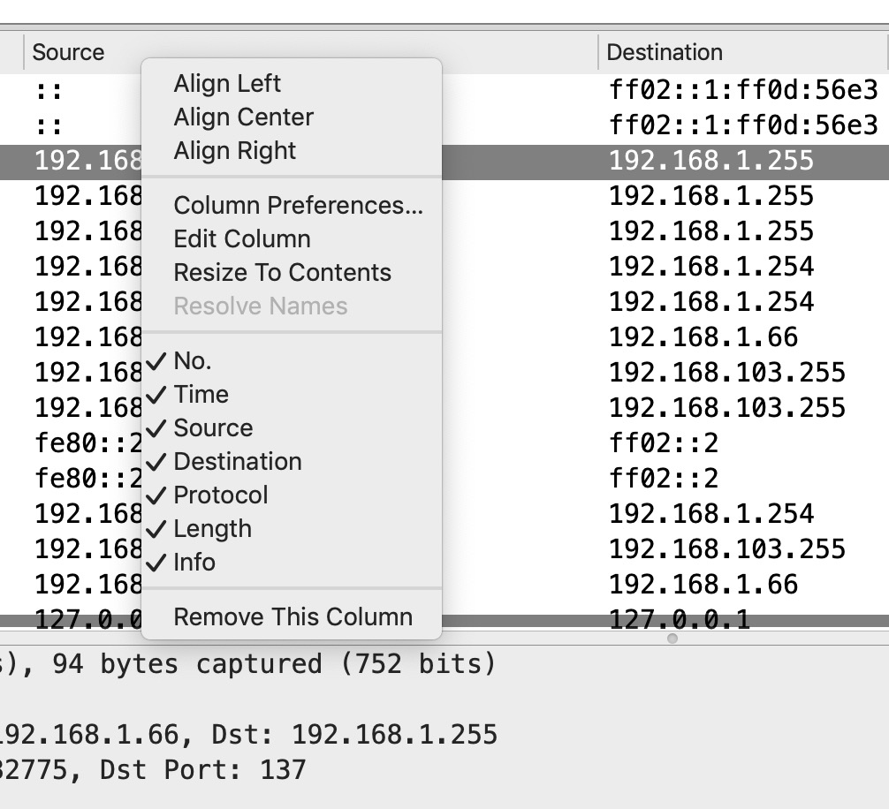
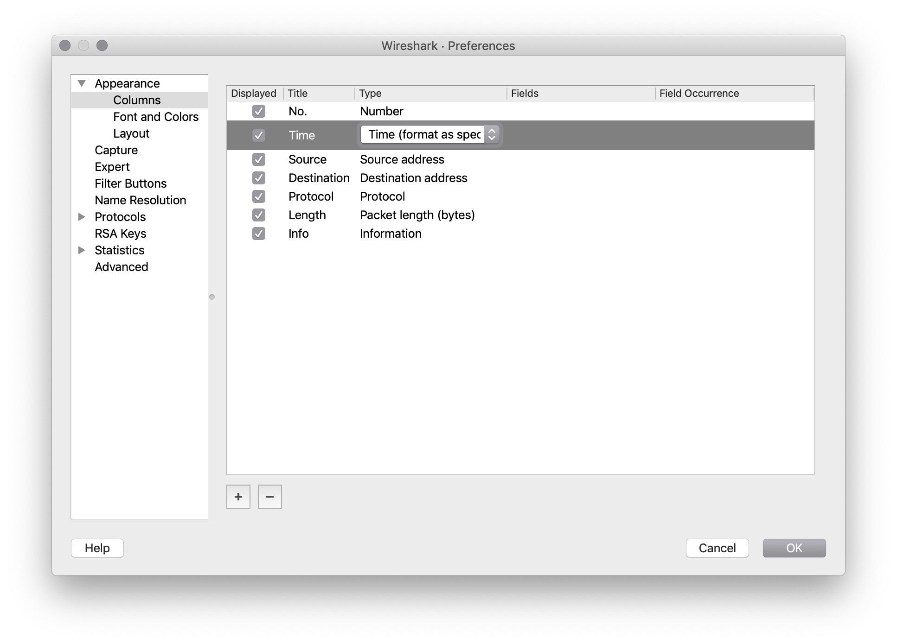
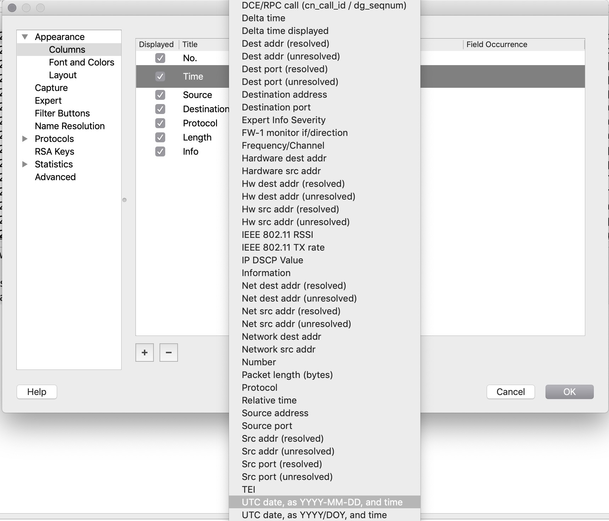
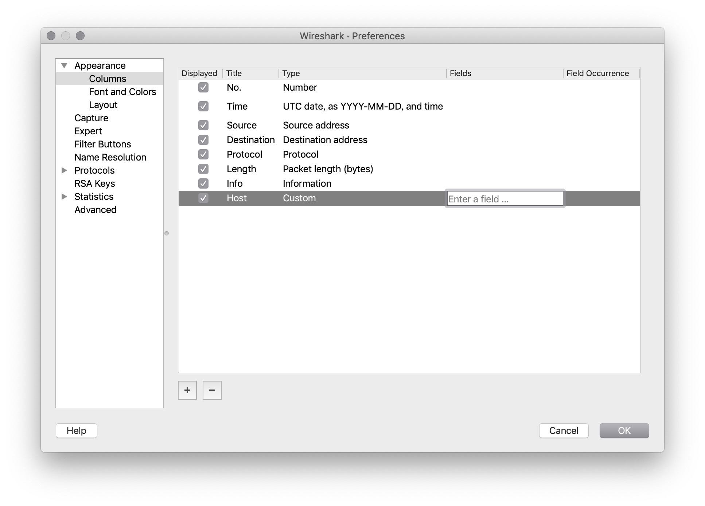

## Activity: Wireshark Tips and Tricks

- In this activity, you will work on customizing your Wireshark setup to be more useful and suited for your personal preferences .

- As you customize Wireshark, keep in mind the following considerations:

    - What is the source and destination of traffic?
    - What are the source and destination ports?
    - What website is the http request coming from?

### Setup

- For this activity, use the pcap file located [HERE](https://wiki.wireshark.org/SampleCaptures?action=AttachFile&do=get&target=Obsolete_Packets.cap)

- This is just a sample pcap so you have data in Wireshark while you make configurations. If you already have a pcap loaded in Wireshark, you can use that.

### Instructions:

Let's start by taking a look at the different column options!

- Did you know you can remove columns by simply right-clicking on them and un-checking or selecting `Remove this Column`?

    - Take out some columns that don't interest you.

    - Some recommended columns to remove might be: `No.` or `Length`

  

- Now create some new columns that might be more helpful!

 - Go to `Edit > Preferences` and choose `Columns` under `Appearance` on the left side. If you're using an Apple computer, the pathway will be `Wireshark > Preferences`

 - Here you will find many different options that can be added or removed.

  

- Let's change the time to be more readable.

    - Change the display of the time column to a more readable format.

    - Click on `Time (format as specified)` and change it to `UTC date, as YYYY-MM-DD, and time`

    
    

- How about a column that shows you the name of a website?

    - Use the `+` sign at the bottom of the window to add a custom column.

    - Change `New Column` to `Host` and in the drop down, choose `Custom`.

    - Double click on the `Fields` column and enter `http.host`.

  
  

- Would it be nice to see source or destination ports?

   - Use the `+` sign again to add a custom column.

   - Change `New Column` to `Src Port` and in the drop down, choose `Source Port`.

  

- Explore other options and take some time to customize your columns exactly to your preference.

- When you are finished with your custom columns, navigate to the `Font and Colors` option.

   - Customize the colors to your liking.

  

   - Remember that you can turn colors off altogether with the color toggle button on the toolbar.

  

- Move on to the Layout option and try out a few different options.

    - Recommendation: Check out the side-by-side option.

    - When you are finished, close the `Preferences` pane.

  

- That's it! Don't be afraid to explore the Wireshark interface to make it more usable.