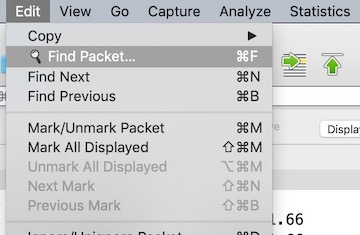
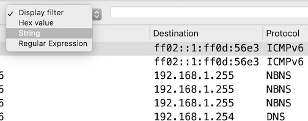
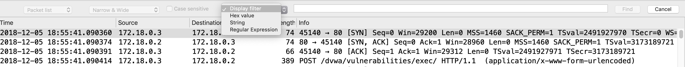
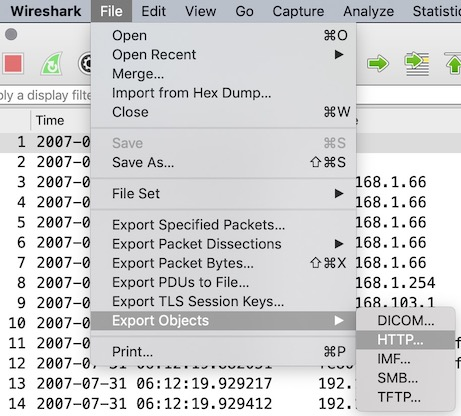
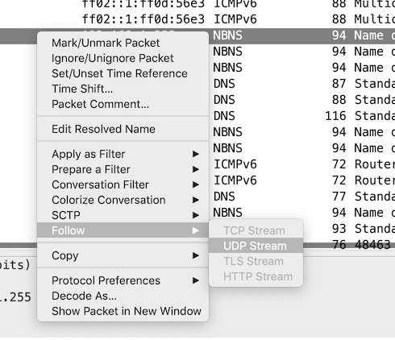
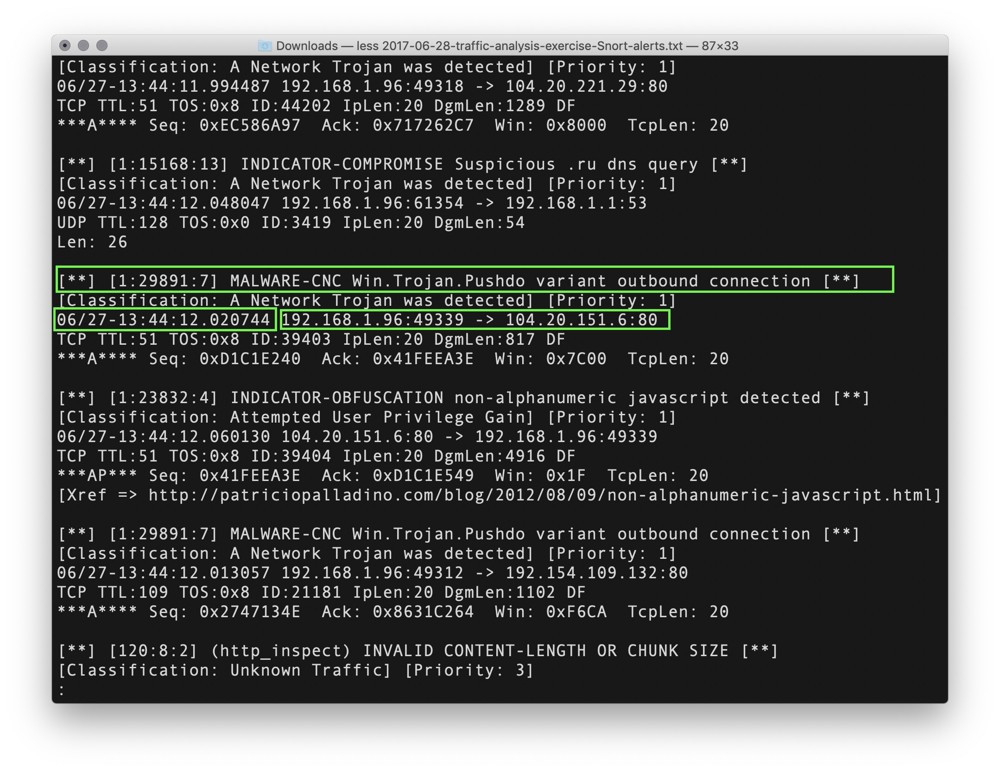
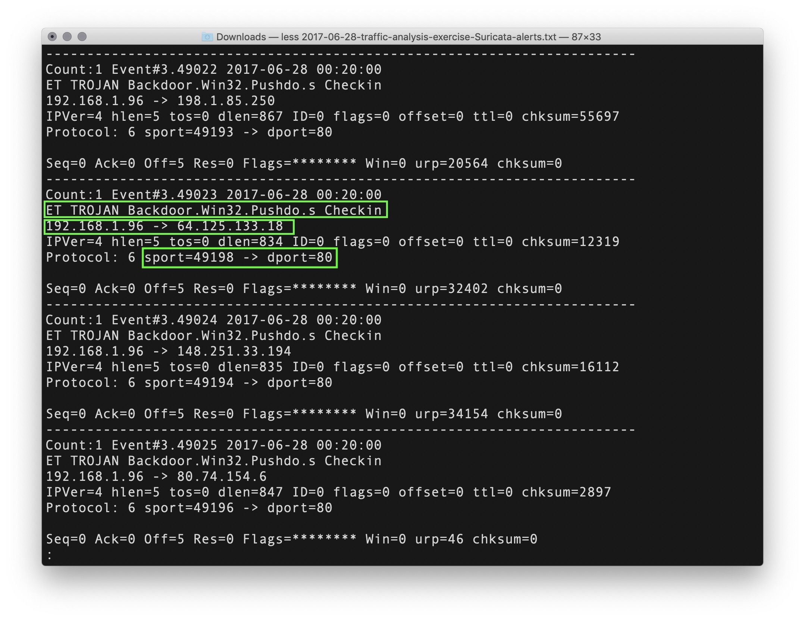
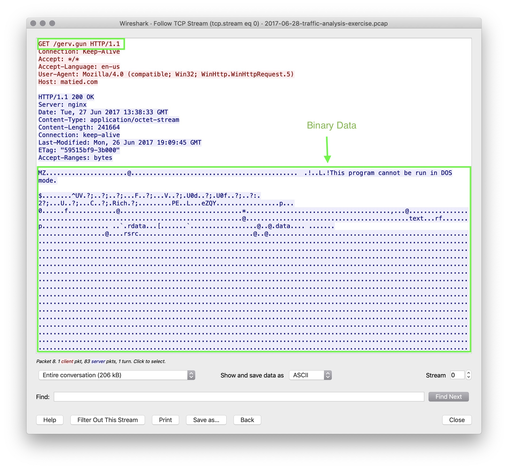

## Incident Response Day 2: Tools and Processes used by SOC Analysts

### Overview

Today's class will begin with a comparison of SIEMs and SOARs, move into investigating alerts, and conclude with a deep-dive into Wireshark.

### Class Objectives

By the end of class, you should be able to:

  - Explain the uses for SIEMs and SOARs and differentiate between the two .

  - Investigate pcap files using Wireshark. 

  - Walk-through the process of investigating an incident.

### Student Notes

* Today's lesson is divided into three sections of lecture, short activity, and a longer follow-along activity. The majority of class time will be the final activity in which you walk through the analysis of an incident.

* **Important**: The next few classes use real incident files and live malware, so make sure you use your VMs in class.

### Slideshow:

- The slideshow for today's class can be found here: [Incident Response Day 2 Slides](https://docs.google.com/presentation/d/1ZjL2KCLss9vY0M8MJ40SKuPr_ta4W59mtH-RSkyeM-s/)

- To add slides to the student-facing repository, download the slides as a PDF by navigating to File > "Download as" and choose "PDF document." Then, add the PDF file to your class repository along with other necessary files.

- **Note:** Editing access is not available for this document. If you or your you wish to modify the slides, please create a copy by navigating to File > "Make a copy...".

### 01. Security Information and Event Management Systems

- Today we will look at some of the tools used by an SOC analyst. We will also walk through the process of responding to an incident.

- Remember that analysis by the Junior SOC analyst is the part of the procedure when an alert will be dismissed as a false positive or elevated into an incident. If it is elevated, they will invoke the planning and teamwork we covered in the previous class.

#### The Importance of Using a Virtual Machine

- While you are already familiar with using a virtual machine, let's briefly explain its importance in the context of Incident Response.

  - Virtual machines are the first resource in the Analyst toolbox. They provide analysts with a platform to view malware, malicious links or other untrustworthy sources. Since these actions take place in a sandbox, it is very difficult for those programs to escape and damage an actual computer or file.

  - However, virtual machines are not impervious to viruses or worms. They serve as a layer of security and a good precaution to take any time we investigate something suspicious.

  - There are some analysts that run everything in virtual machines. There are even virtual machine operating systems, like [QUBES](https://www.qubes-os.org/), that sandbox every aspect of the operating system. Network connections are one sandbox, web browsing another, email another, etc.

- For the rest of this unit, using the class Virtual Machine is absolutely necessary because we will be looking at live malware.

#### SIEM and SOAR
Next, we'll look at SIEMs and SOARs.

- Remember that SIEM stands for Security Information and Event Management. It is useful to remember these acronym for future certification tests.

    - SIEMs receive logs from all the company's systems, including the IPS and IDS, and then output statuses and alerts.

- Security Orchestration, Automation, and Response (SOARs) is the next generation of SIEMS. SOARs will not only send alerts, but also take some automated actions on behalf of an agent.

    - Systems that incorporate SOARs seek to automate security tasks across multiple security systems, applications and appliances in order to save the Analyst time. This might be gathering enrichment data like whois data or threat intelligence data. SOARs may even provide response actions like blocking an IP in a firewall or quarantining a system.

    - The main goal of an IR team is to act on an incident as _quickly as possible_, so if the SIEM system can, for example, gather logs or network information for the Analyst, the Analyst can get to work investigating the incident much sooner.

    - IR team leaders will typically try to identify where the team spends the bulk of their time and have the Security Engineering team automate some or all of those tasks.

- Mention that SOAR systems often use Python scripts to automate these processes. Analysts that know Python are able to review the scripts and make modifications.

- Some of the data sources coming into the SIEM typically include:

  - Firewall logs

  - Unix System logs

  - Proxy Server logs

  - Windows Server logs

- Tasks that a SOAR system might automate include:

  - System data backups

  - IPS/IDS/HIDS

  - Automated Packet Captures for analysis

- Last week we learned about the industry standard SIEM known as Splunk.

- The SIEM marketplace is vast and there are a lot of other companies that provide SIEM software.

- Take a look at the Gartner magic quadrant on the SIEM Market Place:

  

  **Note**: The Gartner Magic Quadrant is developed by Gartner analysts who provide their opinion and perspective on a market segment. This chart is a common evaluation aid used when purchasing a tool in a market segment. The four quadrants are Leader, Visionary, Niche, Challenger. More info is available [here](https://www.sepaforcorporates.com/thoughts/gartner-magic-quadrant-explained-in-about-5-minutes/).

- You should be aware of the biggest players: IBM, McAfee, Splunk and LogRhythm.

- Regardless of the product, all SIEM software is focused on alerting the Incident Response team of issues that the system finds. If the system incorporates SOAR, it may gather some information as well. It is then the duty of the Jr. SOC Analyst to investigate the issue and determine if it is a false positive or an actual issue.

- As a side note, the maintenance and operation of security systems like SIEMs and SOAR are usually the responsibility of the security engineering team. This may also be a good entry point into security for any you with sysadmin or system reliability backgrounds.

### 02. Wireshark Tips and Tricks

Next, we'll run through a demonstration of useful Wireshark techniques:

- For this demonstration, use the pcap file located [here](https://wiki.wireshark.org/SampleCaptures?action=AttachFile&do=get&target=Obsolete_Packets.cap).

  **Note:** This file is only used to have data inside Wireshark, so if you already have a pcap loaded, you can use that.

Begin by covering some common filters.

- **Ask yourself** if you remember any useful filters?

- Run `ip.addr==192.168.1.255` to for filtering an IP.

- Run `ip.src==192.168.103.1` to for filtering a source IP.

- Run `arp` to demonstrate filtering for a protocol.

- Run `frame contains arpa` to demonstrate filtering for a string.

- Remember you can also search the contents of packets by navigating to `Edit > Find Packet`

- Take a look at some compound searches like `ip.src==192.168.1.68 && frame contains arpa`

- Remember how to export HTTP objects by going to `File > Export Objects > HTTP`
    - **Note**: This sample pcap doesn't have any objects to export so you will see a blank window here. Later examples will have files listed that you can save.

- Recall how to follow a TCP or UDP Stream by right clicking and choosing `Follow > TCP/UDP Stream`

### 06. Setting up the Incident Walkthrough

Now, we will move into a walkthrough responding to an incident. The remainder of class should be devoted to this single exercise.

- This exercise and the files were acquired from malware-traffic-analysis.net. This site provides many open-source malware pcap files and activities for anyone to access and use for practicing incident response and / or malware analysis.

    - Author, Brad Duncan (2017). *Infection at the Japan field office.* Retrieved from 

- Emphasize that when it comes to labs, there are usually two types of learners: those who prefer to work backwards from the answers in order to frame an approach for future problems; and those who like to work organically and see if they can arrive at the answers. Both approaches are acceptable for this lesson.

- **Important**! Remember: This exercise uses live malware. Make sure are using your Virtual Machines.

- Begin by downloading the necessary zip files found [here](https://www.malware-traffic-analysis.net/2017/06/28/index.html).
    - Use the password `infected` to open the files. 
 
- Run `unzip 2017-06-28-traffic-analysis-exercise-alerts.zip` to unzip two alert files.

- Run `unzip 2017-06-28-traffic-analysis-exercise-pcap.zip` to unzip the pcap file.

- Explain that as a group we are going to answer the following questions:

    - How can we confirm that a computer was infected with malware?

    - How can we identify which computers were involved in the incident?

    - Can we identify when and how the computer was infected?

    - Can we identify source and destination IP addresses and ports used in the attack?

    - Can we identify the exact malware that was used in the attack?

    - Can we create a firewall rule to prevent this attack in the future?

Now, let's move into the demo.

### 07. Intrusion Detection Alert File Inspection Walkthrough

- We usually start by looking at the alerts from the IDS systems.

- This is often the starting point for a Tier 1 Analyst.

- Starting with the Snort log, run `less 2017-06-28-traffic-analysis-exercise-Snort-alerts.txt` to take a look at the contents of the Snort alert log.

  - Page through the log file a bit and see if you can notice anything that pops out as a potential problem. 

  - If you do not see the Malware Alerts, notice the following: `A Network Trojan was detected` and `MALWARE-CNC Win.Trojan.Pushdo variant outbound connection`
  
  

- Identify Source and Destination IP in those alerts:

    - Source: `192.168.1.96` 
    - Destination: `104.27.158.125`

- Notice that the targeted service destination port: `80`

- We know this source is the IP address of the client infected machine because it's an internal `192.168` address.

- Look at a few other interesting alerts like `INDICATOR-OBFUSCATION`.

- Notice that some of the `CVEs` that Snort gives links to like: [https://cve.mitre.org/cgi-bin/cvename.cgi?name=2013-2028](https://cve.mitre.org/cgi-bin/cvename.cgi?name=2013-2028)

- Now close the Snort logs and open the Suricata alerts with `less 2017-06-28-traffic-analysis-exercise-Suricata-alerts.txt`

- Do you see any similar alerts.

  - Notice that there are alerts like `Significant Security Risk` and `ET TROJAN Backdoor.Win32.Pushdo.s` and note the source and destination IPs again.

- Remember you can use tools like `grep` that can be used to search these alert files. At this point you can even use Splunk to look at these alerts.

- Open Splunk on the VM using `start_splunk`

  - Login and add the IDS logs as data to Splunk.

- Search Splunk for similar alerts.

    - Create a new search by right clicking on items in the alerts like `Win.Trojan.Pushdo`.

- On the left panel, click on `dest_ip 100+` to show the list of destination IP addresses.

- Note that the top destination IP is the same as the one we recorded earlier: `192.168.1.96`

- You can search these alerts by using the command line. You can also use Splunk if they are comfortable with the interface.

- Turn to Google and look up `Pushdo`

- You should easily find some good documentation from the following links:
  - [Pushdo Botnet](https://www.symantec.com/connect/forums/pushdo-botnet) 
  - [Application Control - Pushdo.Botnet](https://fortiguard.com/appcontrol/15235)
  - [Pushdo - Analysis of a Modern Malware Distribution System](https://www.secureworks.com/research/pushdo)

#### Pcap Inspection 

- Move on to inspecting the pcap file `2017-06-28-traffic-analysis-exercise.pcap` that you recently unzipped. 

- Begin by opening the pcap file in Wireshark.

- Ask yourself what steps you would take to investigate this file.

    - Notice that the first source IP address listed is our same `192.168.1.96`

    - We should be looking at traffic based on the information we saw in the IDS alerts.

- Isolate traffic from the sources that triggered alerts:

    - Use `ip.src == 192.168.1.96` to filter for our source IP.

- Further isolate traffic to specific services that triggered alerts:

    - Use `ip.src == 192.168.1.96 && tcp.port == 80`

- Notice the first `HTTP` request to `/gerv.gun`

    - Right click and choose `Follow > TCP Stream`

    - Notice that this TCP Stream contains some kind of executable and you can see in the data `This program cannot be run in DOS mode.`

    

- Close the TCP Stream window and go to `File > Export Objects > HTTP`

- Look at the list that appears and you'll notice the 2 files shown that end in `.exe`

    

- Choose the file `trow.exe` and `wp.exe` and save them to your Virtual Machine.

- Remember how to create an md5 hash of a file:

    - Run `md5sum wp.exe` and `md5sum trow.exe`

    - Output should be: `fb75d4f81be51074bb4147e781e5b402  trow.exe` and `4da48f6423d5f7d75de281a674c2e620  wp.exe`

- Open [VirusTotal](https://www.virustotal.com/#/home/search) and choose the `Search` option in the middle of the page.

- Search for each of the MD5 sums you have created in order to confirm that these files are live malware.

- **Important**: It is important to upload hashes of programs to Virus Total, rather them uploading the file itself.

    - If you upload the file instead of the hash, and the file _is_ legitimate, then you may have just leaked sensitive company data.

    - Even worse, if the file was previously unknown, Virus Total now has copy. At which point, attackers may monitor Virus Total to know when their software has been found and then pivot to another attack.

- These procedures are often the first steps of a Tier 1 Analyst. They take an alert, investigate it, gather information on it and determine if it's a false positive or if there is a true problem.

- This would be considered a `Simple Incident` that one Analyst could resolve. In this case, the Analyst might contact the networking team and ask them to block the offending IP address. In the case of a application attack, the analyst may have the networking team block the IP address and have the security engineers re-image a server.

- If it turned out to be a more complex incident, from here they would escalate to the team's next tier to request support. The next tier would take over the case and may escalate further depending on the severity and the specific organization's IR Plan and Playbooks.

Now, return to the original questions and review:

- How can we confirm that a computer was infected with malware?

  **Solution**: We confirmed by extracting the malware from the pcap file and using Virus Total to verify.

- How can we identify which computers were involved in the attack?

   **Solution**: Show the you that we can easily see the MAC address, host name and operating system of the infected computer by searching the pcap for DHCP traffic OR searching for the string 'Host Name'

     - MAC: `00:15:c5:de:c7:3b`

     - Host Name: `FlashGordon-PC`

- Can we identify the source and destination IP Addresses and Ports used in the attack?

   **Solution:** We can see the source: `192.168.1.96` and destination: `104.27.158.125` in the Snort alerts.

- Can we identify when and how the computer was infected?

   **Solution**: We can see the date and time for the original HTTP request in the pcap.

- Can we identify the exact malware that was used in the attack?

   **Solution**: Snort correctly identified the 'Pushdo Trojan'.

- Can we create a firewall rule to stop this traffic?

   **Solution**: We can easily do this with Wireshark using `Tools > Firewall ACL Rules`

     - Remind the you that this function is not actually configuring a firewall, but Wireshark is just providing potential firewall rules to block traffic for the packet you have selected.

     - Point out that not all of the rules given will be useful.

     - The following rules may help:

        • # IPv4 destination address.

        • iptables --append INPUT --in-interface eth0 --source 119.28.70.207/32 --jump DROP

-------

### Copyright

Trilogy Education Services © 2019. All Rights Reserved.
