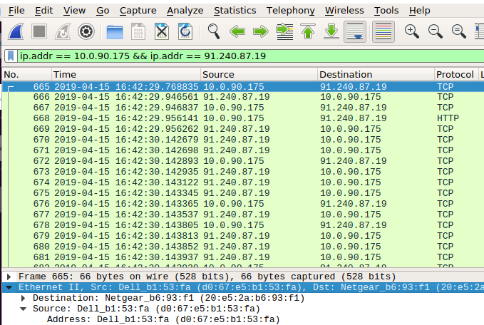
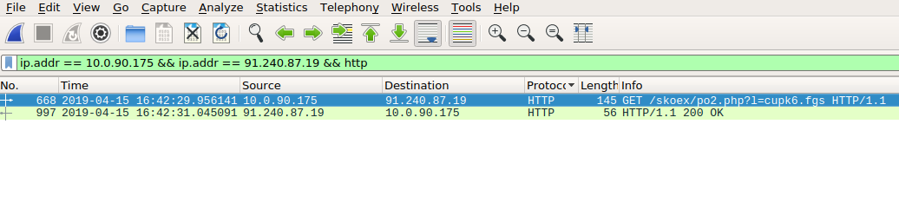
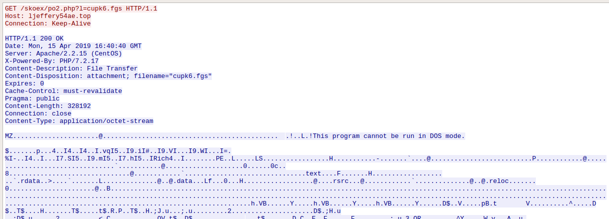
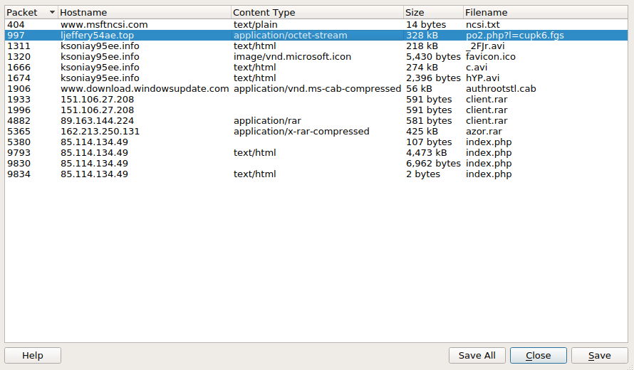
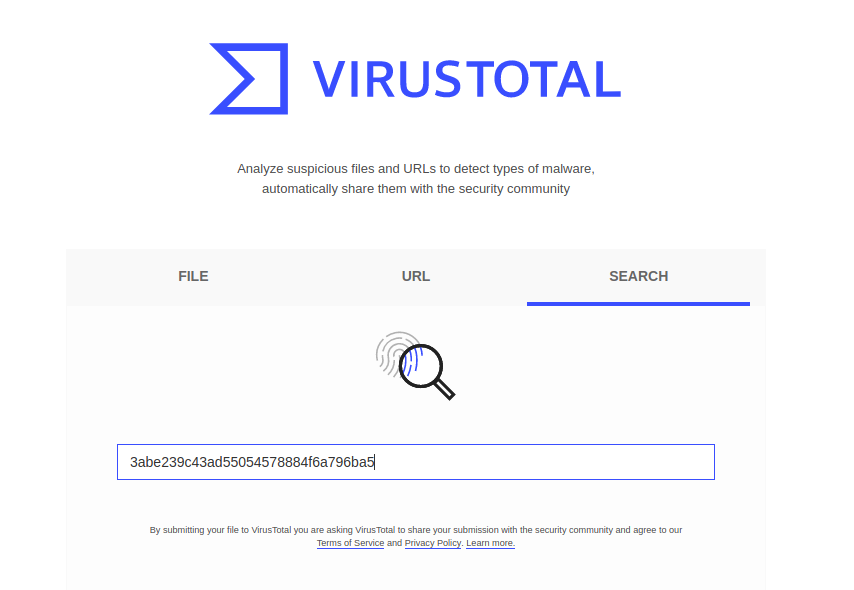
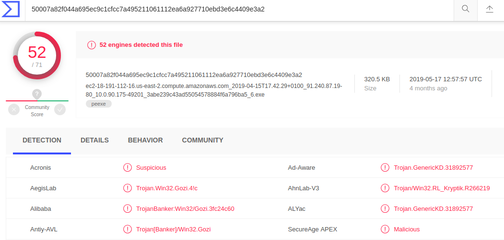

## Solution File: Alert 5! Activity

- In this activity, you will practice responding to an alert to determine if it is a `false positive` or a `true positive` alert.

### Setup

- **Important**: All of today's exercises use live malware. Use your Ubuntu VM to work in a contained environment.

- We will use exercise files from malware-traffic-analysis.net. This site provides many open-source malware pcap files and activities for anyone to access and use to practice incident response and malware analysis.

   - Author, Brad Duncan (2019). *Stingrayahoy* Retrieved from [https://malware-traffic-analysis.net/2019/04/15/index.html](https://malware-traffic-analysis.net/2019/04/15/index.html)

- Move to your documents folder and create an `alert_5` directory for this exercise.

- The files you need are:

  - `https://malware-traffic-analysis.net/2019/04/15/2019-04-15-traffic-analysis-exercise.pcap.zip`

  - `https://malware-traffic-analysis.net/2019/04/15/2019-04-15-traffic-analysis-exercise-alerts.zip`

- Unzip the files. The password for these files is: `infected`.

### Instructions

- In this activity, you will responding to an alert to determine if it is a `False positive` or a `True positive` alert.

- You are provided with a snort alerts file and a pcap file.

#### Answer the following questions:

- What activity is Snort reporting on? (Provide a few alert headlines.)

**Solution**:

```bash
  2 Count:1 Event#3.81745 2019-04-15 16:42 UTC
  3 ETPRO CURRENT_EVENTS MalDoc Requesting Ursnif Payload 2018-09-24
...
 10 Count:2 Event#3.81747 2019-04-15 16:42 UTC
 11 ET POLICY Binary Download Smaller than 1 MB Likely Hostile
...
 18 Count:31 Event#3.81749 2019-04-15 16:42 UTC
 19 ET POLICY PE EXE or DLL Windows file download HTTP
...
 34 Count:5 Event#3.81877 2019-04-15 16:43 UTC
 35 ETPRO TROJAN Ursnif Variant CnC Beacon 8 M1
```

- What is the date and time of the alert?

**Solution**:
```bash
2019-04-15 16:42 UTC
```

- What is the external IP address and port that Snort is flagging?

**Solution**:
```bash
91.240.87.19:80 #Malware is downloaded from this IP:Port
37.230.112.226:80 #Malware reaches out to this IP:Port for CNC commands
```

We can see these in the following alerts:

```bash
 # Malware is downloaded
 10 Count:2 Event#3.81747 2019-04-15 16:42 UTC
 11 ET POLICY Binary Download Smaller than 1 MB Likely Hostile
 12 91.240.87.19 -> 10.0.90.175
 13 IPVer=4 hlen=5 tos=0 dlen=1500 ID=0 flags=0 offset=0 ttl=0 chksum=40298
 14 Protocol: 6 sport=80 -> dport=49201

 # Reaching out for CNC commands
 34 Count:5 Event#3.81877 2019-04-15 16:43 UTC
 35 ETPRO TROJAN Ursnif Variant CnC Beacon 8 M1
 36 10.0.90.175 -> 37.230.112.226
 37 IPVer=4 hlen=5 tos=0 dlen=480 ID=0 flags=0 offset=0 ttl=0 chksum=48545
 38 Protocol: 6 sport=49203 -> dport=80
```

- What is the internal IP address and port that Snort is flagging?

**Solution**:
```bash
10.0.90.175 over port 49201 and 49203
```

#### Now, use the pcap file to answer the following questions: 

- What is the MAC Address of the internal computer involved?

**Solution**:
```bash
Ethernet II, Src: Dell_b1:53:fa (d0:67:e5:b1:53:fa)
```

We can see that the victim machine is a Dell computer with the MAC address: d0:67:e5:b1:53:fa




- What is the host name of the internal machine?

**Solution**:
```bash
Seoul-4a67-PC
```
We can see this in the `bootp` information under `Host Name`:


- Can you confirm the date and time this issue occurred? Does it match the snort alert?

**Solution**:
```bash
2019-04-15 16:42 UTC # snort alert
...
  2 Count:1 Event#3.81745 2019-04-15 16:42 UTC
  3 ETPRO CURRENT_EVENTS MalDoc Requesting Ursnif Payload 2018-09-24
  4 10.0.90.175 -> 91.240.87.19
  5 IPVer=4 hlen=5 tos=0 dlen=131 ID=0 flags=0 offset=0 ttl=0 chksum=41667
  6 Protocol: 6 sport=49201 -> dport=80
  7 
  8 Seq=0 Ack=0 Off=5 Res=0 Flags=******** Win=0 urp=29384 chksum=0
```

Wiresark reports `2019-04-15 16:42:29.956141`




- Can you confirm if the Snort alert was accurate and malware was downloaded?

**Solution**:
We can confirm that the Snort alert time was correct. 
We can follow the TCP stream and see that there was indeed a binary downloaded with the file name `po2.php?1=cupk6.fgs`:




We can export this file from wireshark, hash it and run the hash through virus total to verify that it is malware:




```bash
# hash the file with md5sum
$ md5sum po2.php?1=cupk6.fgs
3abe239c43ad55054578884f6a796ba5  po2.php%3fl=cupk6.fgs
```

Check with Virus Total:






You can also search the offending IP address at Virus Total.

- Would you categorize this alert as a `False Positive` or a `True Positive`?

> **Solution**: This is a True Positive becase malware was indeed downloaded.

- If this issue needs to be mitigated, what steps should be taken with the infected machine?

> **Solution**: This machine should be restored from a backup point before the incident. 

- What steps should be taken in regards to network security?

> **Solution**: The IP addresses 91.240.87.19 and 37.230.112.226 should be blocked by a firewall.

- Would you categorize this issue as a Web, Email or Network attack?

> **Solution**: This is a Trojan Horse web attack because the malicious file was disguised as normal traffic, sent from a website while the user was browsing the site.
