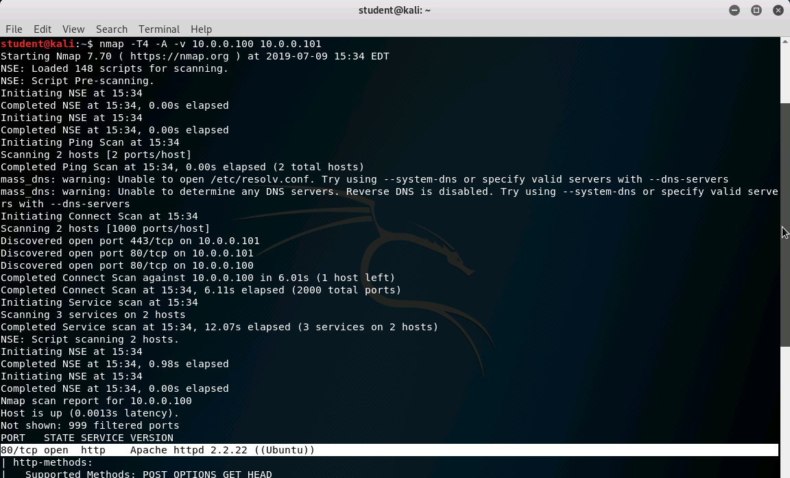
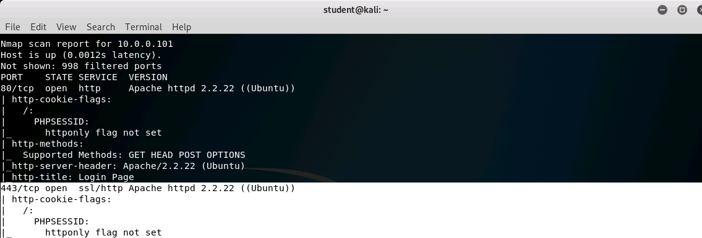

## Solution File: Scanning and Enumeration
Launch the [Linux Exploitation](https://cybrscore.learnondemand.net/Lab/28535) lab. Then, follow the instructions below.

**Note**: You may need to browse to `https://cybrscore.learnondemand.net/CourseAssignment/355258` and search for `Linux Exploitation`.

### Solutions: 

**Instructions and Solutions:**

- Start by using Nmap to perform host discovery on the range on the `10.0.0.0/24` subnet.

    **Solution**: Use the command `nmap -sP 10.0.0.0/24`. You'll identify the hosts `10.0.0.100` and `10.0.0.101`.

- Use Nmap to perform an intense scan on any host you discover.

  **Solution**: Use the command `nmap -T4 -A -v 10.0.0.100 10.0.0.100.101`. You'll find an Apache server on `10.0.0.100:80` and interesting information about the SSL certificate backing `10.0.0.101:443`.

- Test both machines for vulnerability to Shellshock.

   **Solution**: Run `nmap -sV -p 80 --script http-shellshock --script-args uri=/cgi-bin/status.cgi 10.0.0.100 10.0.0.101`. You'll find that `10.0.0.100` is vulnerable.

- The `10.0.0.101` server is vulnerable to Heartbleed, which you'll exploit tomorrow. Use the Q & A section of the [Heartbleed website](http://heartbleed.com) to answer the following questions:

    - Why it is called the Heartbleed Bug?
      - Solution: `There is a Bug in the OpenSSL's heartbeat extension. When exploited it leaks memory content from the server to the attacker and the attacker to the server. `

    - What makes the Heartbleed Bug unique?
      - Solution: `This is a bug that has been around for a "long exposure", and leaves no trace that an attack has actually happened. What makes it dangerous is that private keys were exposed.`

    - What is being leaked?
      - Solution: `1) primary key material, 2) secondary key material and 3) protected content and 4) collateral.`
   
   - What is leaked primary key material and how to recover?
      - Solution: `Encryption keys, these would allow the attacker to decrypt and intercept data whenever they would like. This primes them to do a man in the middle attack. `
   
   - What is leaked secondary key material and how to recover?
      - Solution: `Usernames and passwords. In order to recover, you would have to convince the 3rd party website that you are who you say you are, and then change your passwords.`

    - What is leaked protected content and how to recover?
      - Solution: `This would be the data that was handled by the company that was attacked. This would include, but not limited to medical records and credit cards. Although difficult to recover from it's not impossible. The best way would to be to contact your card company and change your account information. `

    - What is leaked collateral and how to recover?
      - Solution: `These may contain technical information that changes with time. Once the OpenSSL version has been fixed, it loses its value. `

    - What versions of the OpenSSL are affected?
      - Solution: `OpenSSL 1.0.1 through 1.0.1f (inclusive) are vulnerable.`

    - How common are the vulnerable OpenSSL versions?
      - Solution: `The vulnerable versions have been out for over two years now.`
    
**Reference**: http://heartbleed.com/
