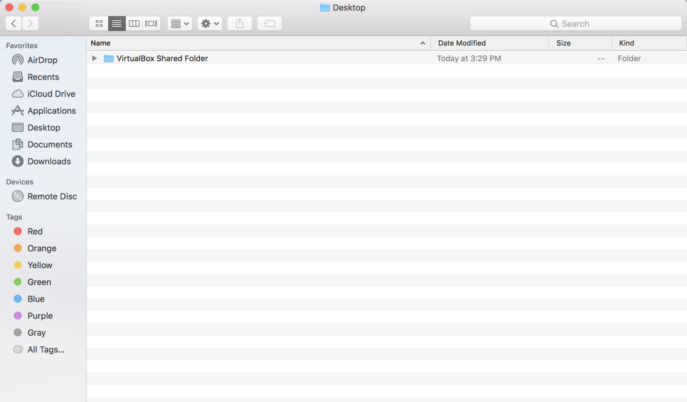
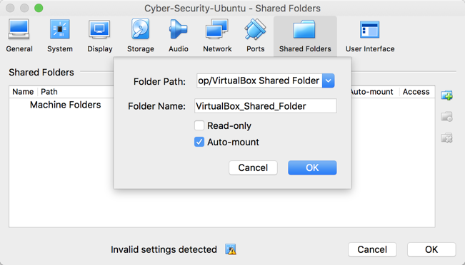
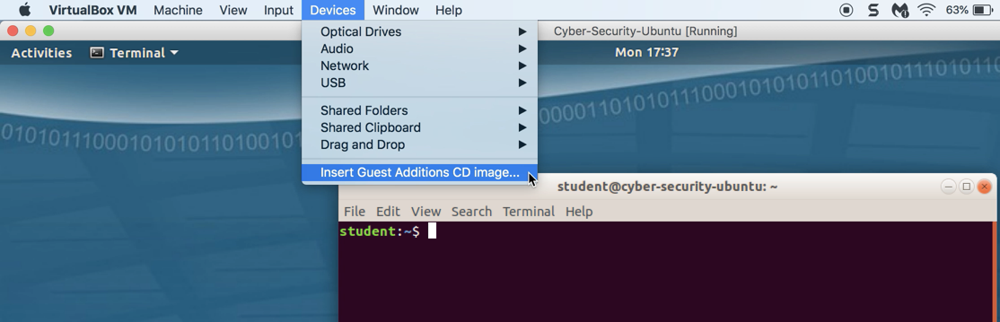
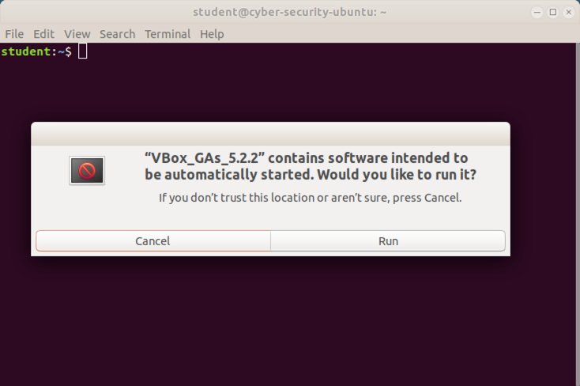
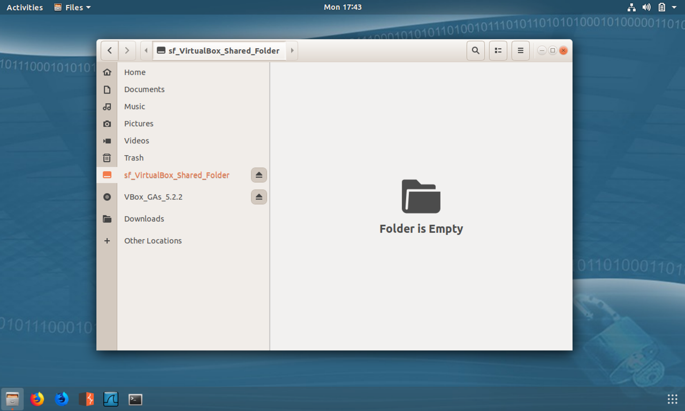

### Sharing Files between Host and VM tutorial 

In this tutorial, you'll learn how to configure your host machine to allow you to easily share files between your guest OS and your host. This feature is called **shared folders**, and makes it easier to move files onto and off of your VM without using the Internet.

You will need to perform these steps for each new VM. Note that you will only need to do it once for each machine you enable sharing for.


**Instructions**

1. On your host computer, create a dedicated folder to share with your VM. 




2. Launch VirtualBox. Click on  `Computer Settings`,  then on  the `Shared Folder` icon. Add the path to your shared folder. 
   -  **Note** if you rename, move, or delete this folder on your host machine, the VM will no longer be able to locate it.


3. Select `Auto Mount`. This causes the VM to find your shared directory when it boots up. 




4. Close the settings pane. Then, launch your VM, and log in.  


5. Look on the drop down menu. Click on  `Devices` > `Install Guest Additions`. This installs software the VM needs to access your shared folder.




6. A new box will appear asking you to confirm the message below. Click **Yes**. 

  ```
  VBox_GAs_5.x.x" contains software intended to be automatically started. Would you like to run it?"
 ```




7. In order to actually read/write to the shared folder, you'll need to add yourself to the special shared folders group. This is the only group that's allowed to update the folder shared with the host. You'll learn more about groups, permissions, and the adduser command in a later lesson. Add yourself to this group by running:
- `adduser student vboxsf`


8. Finally, reboot your VM. When it loads again, you should be able to see your shared folder, and will now be able to click and drag new files or directories directly from your host computer into your VM. 


