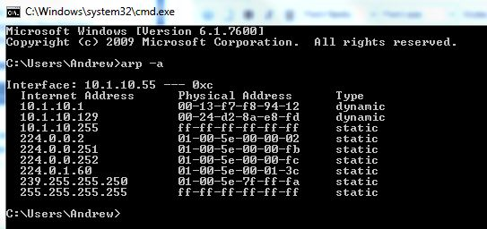
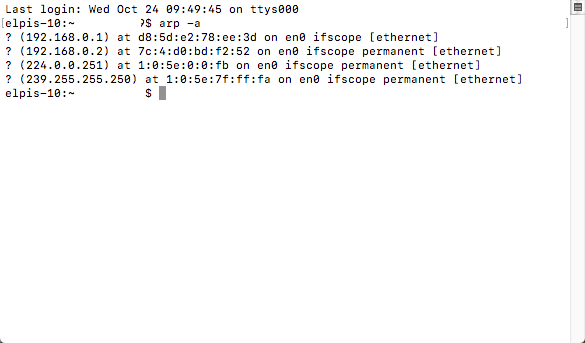

## ARP & RARP

* In this activity, you'll look at two PCAP files.

* With the ARP protocol, it's important to note the following: 
   * Once your computer has discovered the other computer with its IP and MAC address, your computer will create a table known as the ARP Cache Table. 
   * The ARP Cache Table records previous requests and findings from other computers, in order to make the connectivity more facilitated and quicker.
   * The ARP Cache Table is divided into two sections, that being the Dynamic and Static ARP caches. 
      * The Dynamic portion of the ARP Cache Table are for computers that your computer does not often connect to, and will get deleted after some time. 
      * The Static portion remembers devices you connect to often, and will leave it in the table. 
      * The reason for the division, is so that your ARP Cache Table does not take up storage on your computer for devices you do not often connect to. 
   
* This assignment is broken out into two different parts, ARP and RARP. 

### Instructions

- Open the files provided to you.

**ARP**

- Look at the pcap file entitled "arp.pcapng". 

- Based on the information displayed in Wireshark, what is the purpose of ARP?

- What are the IP and MAC addresses of device sending ARP requests and responses? 

- On your personal computer open CMD (for Windows Users) or your terminal (for Mac users), and type the command `arp -a`. 

- Note Windows students will see something simliar to the image below...

- ... And Apple students will see the something similar to the image below

   - Why are there ARP configuration stored onto your computer?
   - Why are there Static and Dynamic ARP configurations?
   - Will a host update its ARP cache for every ARP request? 

**RARP**

- Look at the RARP pcap file entitled "rarp.pcap file. 
- Based on the information displayed in Wireshark, what is the purpose of RARP?

